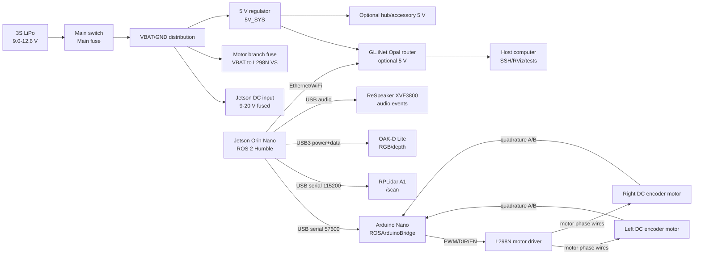
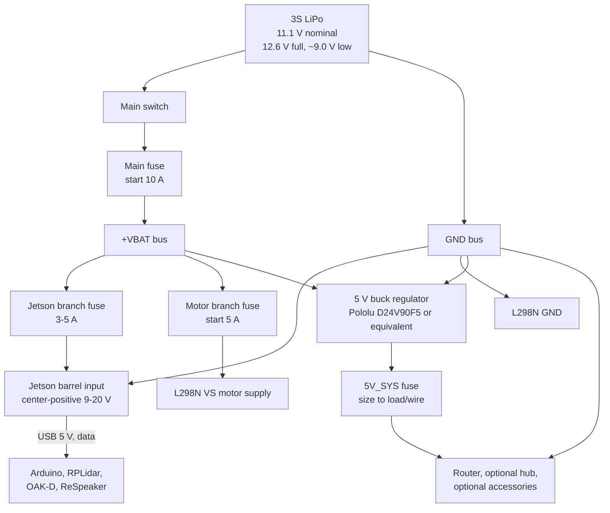
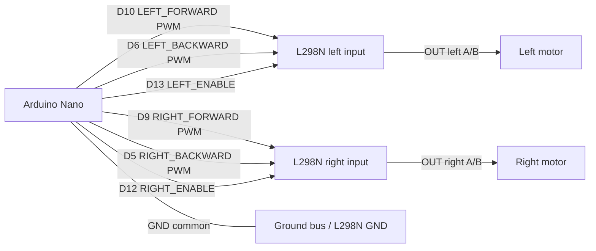
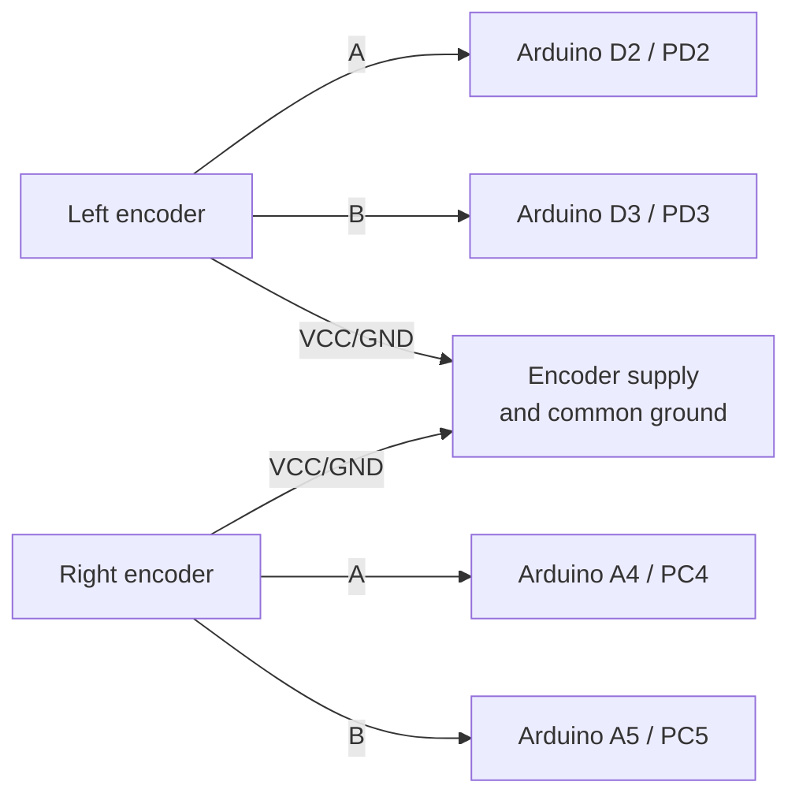

# BillieBot Hardware Build and Test Manual

Revision: v1.0  
Date: 2026-07-04  
Target platform: BillieBot MVP, ROS 2 Humble, Ubuntu 22.04, Jetson Orin Nano

## 1. Purpose and Scope

This manual is a build, wiring, bring-up, calibration, and verification procedure for BillieBot. The goal is that a builder can follow it from bench parts to a verified MVP robot.

BillieBot is an apartment-scale ROS 2 dog companion / dog behavior robot MVP for Billie, a miniature dachshund. The MVP supports:

- Conservative autonomous apartment navigation.
- Deterministic waypoint search for Billie.
- RGB/depth visual detection plumbing for Billie observations.
- Bark and loud-event detection.
- Rule-based Billie state observations.
- Structured SQLite event logging.
- Deterministic daily summaries.

The MVP intentionally does not implement Behavior AI, reinforcement learning, contextual bandits, treat dispensing, autonomous speech engagement, or autonomous social interaction policies. Those are future integration points only.

This manual is derived from the repository source, ROS configuration, URDF, Arduino firmware, existing manual procedures, and the included design PDFs. The original hardware PDF omitted Arduino pin-level detail by design; this manual fills that gap from the checked-in Arduino firmware.

Important source files used:

- `README.md`
- `billiebot_ws/README.md`
- `billiebot_ws/src/billiebot_description/urdf/billiebot.urdf.xacro`
- `billiebot_ws/src/billiebot_control/config/base_driver.yaml`
- `billiebot_ws/src/billiebot_control/firmware/arduino-nano-firmware/ROSArduinoBridge/*`
- `billiebot_ws/src/billiebot_navigation/launch/lidar.launch.py`
- `billiebot_ws/src/billiebot_perception/config/perception.yaml`
- `billiebot_ws/src/billiebot_audio/config/audio.yaml`
- `billiebot_ws/src/billiebot_safety/config/safety.yaml`
- `billiebot_ws/src/billiebot_tests/*`

## 2. Safety Requirements

Treat BillieBot as a moving electromechanical system with a high-current LiPo battery. Do not skip these rules.

1. Disconnect the LiPo before changing wiring.
2. Install the main fuse as close as practical to battery positive.
3. Keep the robot on blocks for the first motor tests.
4. Keep Billie, people, loose clothing, and cables away from the wheels during drive tests.
5. Verify polarity with a multimeter before connecting Jetson, sensors, Arduino, or motor driver.
6. Use a common ground wherever signals cross between boards.
7. Do not power the Jetson Orin Nano through USB-C. Use the DC barrel input or an appropriate carrier-board power input.
8. Do not back-feed Jetson USB ports or sensor USB ports from external 5 V rails.
9. Add a LiPo low-voltage alarm or cutoff. Stop testing before a 3S pack approaches damaging cell voltage.
10. Add foam bumpers before any floor navigation near Billie.
11. Keep initial software limits conservative: maximum linear speed `0.25 m/s`, maximum angular speed `0.9 rad/s`, or lower for early tests.
12. Do not test autonomous navigation until the safety supervisor and command timeout behavior have passed.

## 3. System Overview

BillieBot is a Jetson-centered ROS 2 robot. The Jetson runs ROS 2, navigation, perception plumbing, audio event detection, state estimation, logging, and summaries. The Arduino Nano runs the low-level serial motor bridge, closed-loop wheel PID, encoder counting, and motor-driver signals.



MVP hardware:

| Subsystem | Required MVP hardware | Role |
| --- | --- | --- |
| Compute | Jetson Orin Nano | Primary ROS 2 computer |
| Drive | Differential-drive chassis, two DC encoder motors, 68 mm wheels, caster | Mobile base |
| Low-level control | Arduino Nano | Serial motor/encoder bridge |
| Motor driver | L298N-style dual H-bridge | Bring-up motor driver |
| Power | 3S LiPo, switch, fuses, bus blocks, regulators | Robot power |
| Navigation sensing | RPLidar A1 | 2D planar LaserScan |
| Vision | OAK-D Lite | RGB/depth camera stream |
| Audio | ReSpeaker XVF3800 | USB audio / bark and loud-event input |
| Optional state sensing | DFRobot BNO055/BMP280 | Mounted IMU/barometer; not fused by current MVP software |
| Network | GL.iNet Opal or equivalent | SSH/RViz/ROS network |

Optional hardware is not a verification gate for the MVP:

- Raspberry Pi 5 auxiliary sensor computer.
- Raspberry Pi CSI cameras.
- MLX90640 thermal camera.
- SPH0645 I2S microphone.
- MAX98357A speaker amplifier and speaker.
- Future treat dispenser or social interaction actuators.

## 4. Coordinate Frames and Physical Dimensions

Use the URDF as the physical reference for mounting and software transforms.

| Item | Value / frame | Build meaning |
| --- | --- | --- |
| Robot name | `billiebot` | URDF model root |
| Navigation ground frame | `base_footprint` | Ground-projected navigation base |
| Body frame | `base_link` | Wheel axle center, `0.034 m` above `base_footprint` |
| Chassis link | `chassis_link` | Fixed to `base_link` |
| Wheel radius | `0.034 m` | Nominal 68 mm wheels |
| Wheel width | `0.026 m` | URDF visual/collision width |
| Wheel separation | `0.298 m` | Left/right wheel contact spacing initial value |
| Chassis box | `0.28 x 0.26 x 0.09 m` | Nominal body envelope |
| Chassis origin | `x=0.09, y=0, z=0.0635 m` from `base_link` | Body sits forward of axle |
| Left wheel joint | `left_wheel_joint`, `y=+0.149 m` | Left side of robot |
| Right wheel joint | `right_wheel_joint`, `y=-0.149 m` | Right side of robot |
| Caster | `caster_link`, `x=0.18, z=0.0185 m` from chassis | Front/forward support in current URDF |
| Lidar | `laser_frame`, `x=0.09, y=0, z=0.13575 m` from chassis | Top-center, level, unobstructed |
| OAK-D body frame | `oak_camera_frame`, `x=0.20, y=0, z=0.115 m` from chassis | Front-facing camera body |
| OAK-D optical frame | `oak_camera_optical_frame` | Optical convention child frame |
| IMU | `imu_link`, `x=0.04, y=0, z=0.105 m` from chassis | Rigidly mounted near center |
| Microphone | `mic_link`, `x=0.02, y=0, z=0.14 m` from chassis | Top/front, away from motor noise |

Measure the actual wheel radius, wheel separation, and sensor offsets on the physical robot. The software values are initial bring-up values, not final calibration truth.

## 5. Tools and Consumables

Required tools:

- Multimeter with continuity and DC voltage modes.
- Small screwdrivers for terminal blocks.
- Wire stripper and cutter.
- Crimp tool for your chosen connector family.
- Soldering iron and heat shrink if soldered harnesses are used.
- LiPo charger and LiPo-safe handling/storage bag.
- USB keyboard/monitor or SSH access for Jetson bring-up.
- Host computer for SSH, RViz, and ROS 2 test commands.
- Tape measure, floor tape, and marker for 1 m and 360 deg calibration tests.
- Blocks or stand to lift wheels off the floor.

Recommended consumables:

- 16-18 AWG stranded wire for battery and motor branch wiring, sized up if measured current requires.
- 18-22 AWG stranded wire for 5 V accessory wiring.
- 24-28 AWG wire for encoder, logic, and I2C signals.
- Inline blade fuse holder and spare fuses.
- Heat shrink, cable ties, cable anchors, labels.
- Ferrules or crimp terminals for screw terminals.
- Strain relief for USB cables.
- Foam bumper material.

## 6. Electrical Architecture

BillieBot should use a star-like power distribution: battery to switch/fuse to positive and ground buses, then separate branches for compute, motor power, and regulated 5 V accessories. Keep motor current physically and electrically separated from sensor/audio wiring as much as practical.



### 6.1 Power Rails

| Rail | Nominal voltage | Source | Loads | Interface / connector | Signal | Build notes |
| --- | --- | --- | --- | --- | --- | --- |
| VBAT | 3S LiPo, about 9.0-12.6 V | Battery through main switch and fuse | Branch fuses, Jetson input if allowed, L298N VS, regulator inputs | Battery connector, switch, fuse holder, bus block | Unregulated DC power | High fault current. Fuse near battery positive. |
| MOTOR_PWR | Same as VBAT | Motor branch fuse from VBAT bus | L298N VS motor input | Screw terminal / high-current terminal | High-current motor DC | Keep short, fused, and away from sensor wiring. |
| 5V_SYS | 5.0 V regulated | Buck regulator from VBAT | Router, optional hub, optional accessory loads | Regulator terminal to bus / USB power cable | Regulated DC power | Do not back-feed Jetson USB. Verify polarity and droop under load. |
| JETSON_IN | 9-20 V DC for dev kit barrel input | Fused VBAT or dedicated DC branch | Jetson carrier board | 5.5 x 2.5 mm center-positive barrel plug | Power only | Do not use Jetson USB-C as main power. |
| USB_5V | 5 V | Jetson USB ports | Arduino, RPLidar adapter, OAK-D, ReSpeaker | USB A to device cable | USB power and data | Use direct Jetson ports first. Avoid poor cables/hubs. |
| 3V3_LOGIC | 3.3 V | Jetson/Pi header regulator | I2C/I2S logic only if used | Header pins / STEMMA/Qwiic | Low-current logic power | Do not use as general power bus. |
| 5V_PI | 5.1 V typical | Pi 5 PD board or official Pi supply | Optional Raspberry Pi 5 | Pi 5 power input/PD board | Power only | Optional. Verify exact board before connecting to battery. |

### 6.2 Fuse Starting Points

These are initial bring-up values. Final fuse values must be based on actual measured current and wire gauge.

| Branch | Starting fuse | Adjustment rule |
| --- | --- | --- |
| Main battery | 10 A | Increase only after measured all-up current requires it and wiring supports it. |
| Motor branch | 5 A | If nuisance trips occur, measure running and stall current before increasing. |
| Jetson branch | 3-5 A | At 9-12 V input, a 25 W Jetson load can draw roughly 2-3 A plus conversion loss. |
| 5V_SYS | 5-10 A | Size to wire and downstream loads, not regulator maximum. |
| Router/Pi auxiliary | 2-5 A | Use separate branch protection if powered from robot battery. |

### 6.3 Grounding Rules

1. Create a clearly labeled ground bus.
2. Connect battery negative, regulator input ground, regulator output ground, L298N ground, and accessory grounds to the bus.
3. Ensure Arduino ground and L298N ground share a reference. USB ground through the Jetson may exist, but an explicit Arduino-GND-to-driver-GND signal reference is preferred for the motor driver harness.
4. Do not route motor current through Arduino, Jetson, sensor, or USB shield wires.
5. Twist each motor output pair.
6. Route encoder and I2C wires away from motor output wires and the L298N heatsink.

## 7. Complete Connection Tables

Use these tables as the wiring checklist. Label both ends of every harness before installing it on the robot.

### 7.1 Power Distribution Connections

| Link ID | From | To | Interface | Connector | Signal / rail | Power present | Required check |
| --- | --- | --- | --- | --- | --- | --- | --- |
| PWR-01 | 3S LiPo positive | Main switch input | High-current DC | Battery connector to switch harness | VBAT positive | 9.0-12.6 V | Battery disconnected while wiring; correct connector polarity. |
| PWR-02 | Main switch output | Main fuse input | High-current DC | Inline fuse holder | Switched VBAT positive | 9.0-12.6 V | Fuse holder rated for expected current. |
| PWR-03 | Main fuse output | +VBAT bus | High-current DC | Ring/ferrule/screw terminal | Protected VBAT positive | 9.0-12.6 V | Fuse close to battery positive. |
| PWR-04 | 3S LiPo negative | GND bus | High-current DC return | Battery connector to ground bus | Battery ground | Return current | Low-resistance connection. |
| PWR-05 | +VBAT bus | Jetson branch fuse | DC power branch | Bus to inline fuse | Jetson input positive | 9.0-12.6 V or regulated input | Fuse 3-5 A starting point. |
| PWR-06 | Jetson branch fuse | Jetson DC barrel center pin | DC power | 5.5 x 2.5 mm center-positive barrel plug | JETSON_IN positive | 9-20 V | Confirm center positive before plugging in. |
| PWR-07 | GND bus | Jetson DC barrel sleeve | DC return | Barrel plug sleeve | JETSON_IN ground | Return current | Verify no reverse polarity. |
| PWR-08 | +VBAT bus | Motor branch fuse | DC power branch | Bus to inline fuse | Motor branch positive | 9.0-12.6 V | Start with 5 A. |
| PWR-09 | Motor branch fuse | L298N VS / motor supply positive | High-current DC | Screw terminal | MOTOR_PWR positive | 9.0-12.6 V | Motor power off during first serial tests. |
| PWR-10 | GND bus | L298N GND / motor supply ground | High-current return | Screw terminal | Motor return and logic reference | Return current | Common ground required with Arduino. |
| PWR-11 | +VBAT bus | 5 V regulator input positive | DC power | Regulator input terminal | Regulator input | 9.0-12.6 V | Confirm regulator input range. |
| PWR-12 | GND bus | 5 V regulator input negative | DC return | Regulator input terminal | Regulator ground | Return current | Shared with robot ground bus. |
| PWR-13 | 5 V regulator output positive | 5V_SYS fuse or 5 V bus | Regulated DC | Regulator output terminal | 5V_SYS positive | 5.0 V | Verify unloaded before connecting loads. |
| PWR-14 | 5 V regulator output ground | GND bus / 5 V return | Regulated return | Regulator output terminal | 5V_SYS ground | Return current | Common with main ground. |
| PWR-15 | 5V_SYS bus | GL.iNet Opal USB-C input | Regulated accessory power | USB-C power cable or rated adapter | 5 V router power | 5 V | Optional during bench tests; wall supply acceptable. |
| PWR-16 | 5V_SYS bus | Optional powered USB hub/accessories | Regulated accessory power | Hub input connector | 5 V accessory power | 5 V | Do not use hub for first OAK-D bring-up. |
| PWR-17 | Optional Pi power branch | Raspberry Pi 5 PD board | DC/PD board-specific | Board-specific connector | 5 V Pi power or board input | Board-specific | Optional; verify exact board input method. |

### 7.2 Jetson Data and USB Connections

| Link ID | From | To | Interface | Connector | Signal | Power present | Software expectation |
| --- | --- | --- | --- | --- | --- | --- | --- |
| USB-01 | Jetson USB Type-A | Arduino Nano Mini-USB | USB 2 serial | USB A to Mini-B | Serial motor commands and encoder replies | USB 5 V to Arduino unless separately powered | `/dev/serial/by-id/usb-1a86_USB_Serial-if00-port0`, 57600 baud |
| USB-02 | Jetson USB Type-A | RPLidar A1 USB adapter | USB serial | RPLidar USB adapter cable | Lidar packets | USB 5 V | `/scan`, `laser_frame`, 115200 baud |
| USB-03 | Jetson USB 3 Type-A | OAK-D Lite USB-C | USB 3 | USB A to USB-C | RGB, depth, camera info, device control | USB 5 V | `/oak/rgb/image_raw`, `/oak/stereo/depth`, `/oak/rgb/camera_info` |
| USB-04 | Jetson USB Type-A | ReSpeaker XVF3800 | USB audio/control | USB cable | Audio input/control | USB 5 V | `/billie/audio_events` from audio node |
| NET-01 | Jetson Ethernet | GL.iNet Opal LAN | Ethernet | RJ45 | IP network: SSH, ROS 2 DDS, RViz | None | Prefer Ethernet for stable remote development |
| NET-02 | Host computer | GL.iNet Opal | WiFi or Ethernet | WiFi/RJ45 | SSH, RViz, test control | None | Host off robot motor power |

Recommended first-pass port assignment:

| Jetson port | Device | Reason |
| --- | --- | --- |
| USB 3 Type-A #1 | OAK-D Lite | Highest bandwidth device; avoid hubs initially. |
| USB 3 Type-A #2 | RPLidar A1 | Navigation-critical serial device. |
| USB 3 Type-A #3 | ReSpeaker XVF3800 | Audio input. |
| USB 3 Type-A #4 | Arduino Nano | Drive interface; low bandwidth but timing-critical. |
| Optional hub | Keyboard, mouse, non-critical serial devices | Add only after direct device tests pass. |

### 7.3 Arduino Nano to L298N Motor Driver

The checked-in firmware selects `L298_MOTOR_DRIVER`, `ARDUINO_ENC_COUNTER`, `USE_BASE`, and disables servos. Firmware baud rate is `57600`. Commands are CR-terminated.

| Link ID | Arduino firmware signal | Arduino Nano pin | L298N/module pin | Interface | Connector | Signal | Direction | Required check |
| --- | --- | --- | --- | --- | --- | --- | --- | --- |
| MOT-01 | `RIGHT_MOTOR_BACKWARD` | D5 | Right motor backward / INx | PWM-capable digital | Header jumper | Right reverse PWM | Arduino to L298N | Reverse command drives right wheel backward. |
| MOT-02 | `LEFT_MOTOR_BACKWARD` | D6 | Left motor backward / INx | PWM-capable digital | Header jumper | Left reverse PWM | Arduino to L298N | Reverse command drives left wheel backward. |
| MOT-03 | `RIGHT_MOTOR_FORWARD` | D9 | Right motor forward / INx | PWM-capable digital | Header jumper | Right forward PWM | Arduino to L298N | Positive right command drives right wheel forward. |
| MOT-04 | `LEFT_MOTOR_FORWARD` | D10 | Left motor forward / INx | PWM-capable digital | Header jumper | Left forward PWM | Arduino to L298N | Positive left command drives left wheel forward. |
| MOT-05 | `RIGHT_MOTOR_ENABLE` | D12 | Right enable / ENB or equivalent | Digital output | Header jumper | Right H-bridge enable | Arduino to L298N | Firmware sets HIGH in `initMotorController()`. |
| MOT-06 | `LEFT_MOTOR_ENABLE` | D13 | Left enable / ENA or equivalent | Digital output | Header jumper | Left H-bridge enable | Arduino to L298N | Firmware sets HIGH in `initMotorController()`. |
| MOT-07 | Arduino GND | GND | L298N logic GND | Ground reference | Header/screw terminal | Logic ground | Common | Required for valid PWM/DIR signals. |
| MOT-08 | 5 V logic source | Arduino 5 V or clean 5V_SYS | L298N 5 V logic input if module requires | Logic power | Header/screw terminal | 5 V logic | Power | Use one clean 5 V logic path; avoid backfeed. |

L298N modules vary in silkscreen labels. Map the firmware signals to the module's two H-bridge input pairs and enables. If a module uses `IN1/IN2/IN3/IN4`, document the final mapping on the robot harness label.

### 7.4 L298N to Motors

| Link ID | From | To | Interface | Connector | Signal | Power present | Required check |
| --- | --- | --- | --- | --- | --- | --- | --- |
| DRV-01 | L298N left output A | Left motor terminal A | H-bridge motor phase | Screw terminal / motor connector | Switched motor voltage | MOTOR_PWR | Wheel turns forward for positive left command. |
| DRV-02 | L298N left output B | Left motor terminal B | H-bridge motor phase | Screw terminal / motor connector | Switched motor voltage | MOTOR_PWR | Swap A/B if direction is wrong and sign correction is not desired. |
| DRV-03 | L298N right output A | Right motor terminal A | H-bridge motor phase | Screw terminal / motor connector | Switched motor voltage | MOTOR_PWR | Wheel turns forward for positive right command. |
| DRV-04 | L298N right output B | Right motor terminal B | H-bridge motor phase | Screw terminal / motor connector | Switched motor voltage | MOTOR_PWR | Swap A/B if direction is wrong and sign correction is not desired. |

The software also provides `left_motor_sign`, `right_motor_sign`, `left_encoder_sign`, and `right_encoder_sign` in `billiebot_control/config/base_driver.yaml`. Use wiring to get close, then use software sign parameters for final convention if needed.

### 7.5 Wheel Encoders to Arduino

The firmware uses AVR port-change interrupts and direct port reads. Do not move these pins without changing firmware.

| Link ID | Encoder signal | Motor/encoder harness | Arduino Nano pin | Firmware symbol | Interface | Connector | Signal | Required check |
| --- | --- | --- | --- | --- | --- | --- | --- | --- |
| ENC-01 | Left encoder A | Left encoder A output | D2 | `LEFT_ENC_PIN_A` / `PD2` | Digital input, interrupt | Encoder harness | Quadrature A pulses | Count changes when left wheel rotates. |
| ENC-02 | Left encoder B | Left encoder B output | D3 | `LEFT_ENC_PIN_B` / `PD3` | Digital input, interrupt | Encoder harness | Quadrature B pulses | Direction sign correct after forward rotation. |
| ENC-03 | Right encoder A | Right encoder A output | A4 | `RIGHT_ENC_PIN_A` / `PC4` | Digital input, interrupt | Encoder harness | Quadrature A pulses | Count changes when right wheel rotates. |
| ENC-04 | Right encoder B | Right encoder B output | A5 | `RIGHT_ENC_PIN_B` / `PC5` | Digital input, interrupt | Encoder harness | Quadrature B pulses | Direction sign correct after forward rotation. |
| ENC-05 | Encoder VCC | Left encoder VCC | 5 V or motor-specified logic supply | N/A | Sensor power | Encoder harness | Encoder supply | Verify motor encoder voltage requirement. |
| ENC-06 | Encoder GND | Left encoder GND | Arduino GND / GND bus | N/A | Sensor return | Encoder harness | Encoder ground | Common with Arduino GND. |
| ENC-07 | Encoder VCC | Right encoder VCC | 5 V or motor-specified logic supply | N/A | Sensor power | Encoder harness | Encoder supply | Verify motor encoder voltage requirement. |
| ENC-08 | Encoder GND | Right encoder GND | Arduino GND / GND bus | N/A | Sensor return | Encoder harness | Encoder ground | Common with Arduino GND. |

The firmware enables internal pullups on these encoder pins. If the encoder module has open-collector outputs, this is compatible. If the encoder module has push-pull outputs, verify voltage compatibility with the Nano input pins.

### 7.6 Navigation and Perception Sensors

| Link ID | Component | From | To | Interface | Connector | Signal | Power present | Mounting/software requirement |
| --- | --- | --- | --- | --- | --- | --- | --- | --- |
| SNS-01 | RPLidar A1 | Jetson USB | RPLidar USB adapter | USB serial | USB cable | Lidar scan packets | USB 5 V | Mount level, unobstructed 360 deg, frame `laser_frame`. |
| SNS-02 | OAK-D Lite | Jetson USB 3 | OAK-D USB-C | USB 3 | USB A to USB-C | RGB image, depth image, camera info | USB 5 V | Mount front-facing, rigid, frame `oak_camera_frame` / `oak_camera_optical_frame`. |
| SNS-03 | ReSpeaker XVF3800 | Jetson USB | ReSpeaker USB | USB audio/control | USB cable | Audio stream/features | USB 5 V | Mount near top/front, away from fan exhaust and L298N. |
| SNS-04 | BNO055/BMP280 | Jetson or Pi I2C header | DFRobot Gravity I2C module | I2C | JST/header/Qwiic as applicable | SDA, SCL | 3.3-5 V module supply | Optional in MVP; represented as `imu_link`, no current fusion node. |
| SNS-05 | MLX90640 optional | Jetson or Pi I2C header | MLX90640 breakout | I2C | STEMMA/Qwiic/header | Thermal image frames | 3.3-5 V breakout supply | Optional future sensor; not required for MVP. |
| SNS-06 | Pi Camera optional | Raspberry Pi 5 CSI | Pi camera module | MIPI CSI-2 | 22-pin/15-pin FPC adapter as required | Image data | Camera power through CSI | Optional. Do not include in MVP acceptance. |
| SNS-07 | SPH0645 optional | Pi/Jetson I2S header | SPH0645 breakout | I2S | Header wires | BCLK, LRCLK/WS, data | 1.6-3.3 V only | Optional; never connect to 5 V logic. |
| SNS-08 | MAX98357A optional | Pi/Jetson I2S header | MAX98357A amplifier | I2S + speaker output | Header + speaker terminal | Digital audio in, speaker out | 2.7-5.5 V amp power | Optional future output. |

### 7.7 ROS Interface Map

| Link ID | Producer | Consumer | Interface | Connector / transport | Signal | Acceptance evidence |
| --- | --- | --- | --- | --- | --- | --- |
| ROS-01 | Nav2, teleop, tests | `billiebot_safety` | ROS topic `/cmd_vel` | DDS over local ROS graph | Desired velocity | Safety node receives commands. |
| ROS-02 | `billiebot_safety` | `diff_drive_base` | ROS topic `/cmd_vel_safe` | DDS | Clamped safe velocity | `/cmd_vel_safe` limited to configured bounds. |
| ROS-03 | `diff_drive_base` | Arduino Nano | USB serial | USB A to Mini-B | `m L R`, `e`, `r`, CR-terminated | Arduino replies `OK` or encoder counts. |
| ROS-04 | Arduino Nano | `diff_drive_base` | USB serial | USB A to Mini-B | Encoder counts | `/odom`, `/joint_states`, `/tf` update. |
| ROS-05 | RPLidar node | SLAM, AMCL, Nav2 costmaps | ROS topic `/scan` | USB serial to ROS node | `sensor_msgs/LaserScan` | Non-empty ranges above minimum rate. |
| ROS-06 | OAK-D node | Detector | ROS topics `/oak/rgb/image_raw`, `/oak/stereo/depth`, `/oak/rgb/camera_info` | USB 3 to ROS node | RGB/depth/camera info | Non-zero image dimensions. |
| ROS-07 | Detector | State estimator/logging | ROS topic `/billie/detections` | DDS | `BillieDetectionArray` | Detections published in mock or hardware mode. |
| ROS-08 | Audio node | State estimator/logging | ROS topic `/billie/audio_events` | USB audio / DDS | `AudioEvent` | Bark/loud-noise event received. |
| ROS-09 | State estimator | Logger/future AI | ROS topic `/billie/state` | DDS | `BillieStateObservation` | State labels published. |
| ROS-10 | Safety node | Logger/future AI | ROS topic `/billiebot/mode` | DDS | `SystemMode` | Modes `idle`, `active`, `stopped`, `estop`. |
| ROS-11 | Logger | Summary generator | SQLite database | Filesystem | Event rows | `~/.billiebot/billiebot_events.sqlite3` or test DB has rows. |

## 8. Software Configuration Values

### 8.1 Drive Configuration

From `billiebot_control/config/base_driver.yaml`:

| Parameter | Initial value | Meaning |
| --- | --- | --- |
| `port` | `/dev/serial/by-id/usb-1a86_USB_Serial-if00-port0` | Arduino serial device path |
| `baudrate` | `57600` | Arduino firmware baud rate |
| `cmd_vel_topic` | `/cmd_vel_safe` | Safety-supervised command input |
| `wheel_radius` | `0.034` | Wheel radius in meters |
| `wheel_separation` | `0.298` | Track width in meters |
| `encoder_ticks_per_rev` | `2000.0` | Initial encoder ticks per wheel revolution |
| `pid_rate_hz` | `30.0` | Arduino PID frame rate |
| `max_linear_velocity` | `0.25` | Drive clamp in m/s |
| `max_angular_velocity` | `0.9` | Drive clamp in rad/s |
| `cmd_timeout_sec` | `0.5` | ROS drive command timeout |
| `publish_rate_hz` | `30.0` | Odometry/joint publication rate |
| `odom_frame` | `odom` | Odometry frame |
| `base_frame` | `base_footprint` | Robot base frame for odometry |
| `left_motor_sign` | `1.0` | Software motor sign |
| `right_motor_sign` | `1.0` | Software motor sign |
| `left_encoder_sign` | `1.0` | Software encoder sign |
| `right_encoder_sign` | `1.0` | Software encoder sign |
| `reset_encoders_on_start` | `true` | Sends `r` at startup |
| `publish_tf` | `true` | Publishes odom transform |

### 8.2 Arduino Firmware Configuration

From `ROSArduinoBridge.ino` and headers:

| Firmware item | Value |
| --- | --- |
| Base controller | `USE_BASE` enabled |
| Motor driver | `L298_MOTOR_DRIVER` |
| Encoder mode | `ARDUINO_ENC_COUNTER` |
| Servo support | Disabled |
| Baud rate | `57600` |
| PID rate | `30 Hz` |
| Firmware auto-stop | `2000 ms` since last motor command |
| Maximum PWM | `255` |
| PID defaults | `Kp=20`, `Kd=12`, `Ki=0`, `Ko=50` |
| Encoder read command | `e` |
| Encoder reset command | `r` |
| Motor closed-loop command | `m <left_counts_per_loop> <right_counts_per_loop>` |
| Raw PWM command | `o <left_pwm> <right_pwm>` |
| Command terminator | Carriage return (`CR`) |

### 8.3 Lidar Configuration

| Parameter | Initial value |
| --- | --- |
| Launch | `ros2 launch billiebot_bringup lidar.launch.py mock_lidar:=false` |
| Device path | `/dev/serial/by-id/usb-Silicon_Labs_CP2102_USB_to_UART_Bridge_Controller-if00-port0` |
| Baud rate | `115200` |
| Frame | `laser_frame` |
| Topic | `/scan` |
| Driver package | `rplidar_ros` |

### 8.4 OAK-D / Perception Configuration

| Parameter | Initial value |
| --- | --- |
| Launch | `ros2 launch billiebot_bringup oakd.launch.py mock_camera:=false` |
| Driver | `depthai_ros_driver`, executable `camera`, name `oak` |
| RGB topic | `/oak/rgb/image_raw` |
| Depth topic | `/oak/stereo/depth` |
| Camera info topic | `/oak/rgb/camera_info` |
| Mock camera frame | `oak_camera_optical_frame` |
| Mock image size | `640 x 400` |
| Mock publish rate | `10 Hz` |
| Detector backend default | `mock` |
| Detection topic | `/billie/detections` |
| Detector camera frame | `oak_camera_frame` |

### 8.5 Audio Configuration

| Parameter | Initial value |
| --- | --- |
| Launch | `ros2 launch billiebot_bringup audio.launch.py` |
| Audio device | `default` |
| Direct capture | `use_audio_device: false` by default |
| Audio level topic | `/billiebot/audio_level_db` |
| Sample rate | `16000` |
| Frame size | `1024` |
| Loudness threshold | `68.0 dB` |
| Minimum event duration | `0.15 s` |
| Event cooldown | `1.0 s` |
| Output topic | `/billie/audio_events` |
| Message frame | `mic_link` |

### 8.6 Safety Configuration

| Parameter | Initial value |
| --- | --- |
| Input command topic | `/cmd_vel` |
| Output command topic | `/cmd_vel_safe` |
| Max linear velocity | `0.25 m/s` |
| Max angular velocity | `0.9 rad/s` |
| Command timeout | `0.5 s` |
| Publish rate | `20 Hz` |
| E-stop topic | `/billiebot/estop` |
| E-stop service | `/billiebot/set_estop` |
| Mode topic | `/billiebot/mode` |

## 9. Mechanical Assembly Procedure

### 9.1 Prepare the Chassis

1. Place the chassis plate on a flat bench.
2. Mark the forward direction with tape or paint.
3. Mark the wheel axle line. In the URDF, `base_link` is at the wheel axle center.
4. Mark the centerline left-to-right.
5. Mark the intended component zones:
   - Battery low and central.
   - Jetson with airflow and cable access.
   - Arduino and L298N near the drive motors, but not under sensor cables.
   - RPLidar high, level, and unobstructed.
   - OAK-D forward-facing at the front.
   - ReSpeaker top/front, away from fan exhaust and L298N.
   - IMU near center, rigidly mounted, away from motor magnets/wires.
6. Deburr holes and install standoffs before mounting electronics.

Pass condition: no sharp edges contact wires, and each board has a secure mounting location with cable strain relief.

### 9.2 Install Drive Motors and Wheels

1. Mount the left and right DC encoder motors symmetrically on the axle line.
2. Install motor brackets tightly enough that the motor shafts cannot twist under load.
3. Install the 68 mm wheels.
4. Confirm wheels spin freely by hand.
5. Measure wheel separation between the left and right wheel contact patch centers. Record it in the build log.
6. Confirm the nominal initial software value `0.298 m`; update later after calibration.
7. Label the left motor harness `LEFT_MOTOR` and right motor harness `RIGHT_MOTOR`.
8. Label motor power leads separately from encoder leads.

Pass condition: both wheels are coaxial, parallel, and free of rubbing. Wheel separation is recorded.

### 9.3 Install Caster

1. Mount the caster on the centerline.
2. Place it so the robot sits level and keeps adequate weight on the drive wheels.
3. Verify caster swivel clearance through full rotation.
4. Set the robot on a flat surface and check for rocking.

Pass condition: all wheels contact the ground, the chassis is stable, and drive wheels retain traction.

### 9.4 Install Battery and Power Distribution

1. Mount the LiPo low and central with a strap or enclosure.
2. Mount the main switch where it is reachable from outside the robot.
3. Mount the main fuse holder close to battery positive.
4. Mount the VBAT and GND bus blocks where wires cannot short to the chassis.
5. Mount the 5 V regulator with airflow.
6. Mount branch fuse holders for motor, Jetson, and 5V_SYS where practical.
7. Label every power bus:
   - `VBAT`
   - `GND`
   - `5V_SYS`
   - `MOTOR_PWR`
   - `JETSON_IN`
8. Do not connect the battery yet.

Pass condition: all power hardware is mechanically secured and labeled, with no live battery connected.

### 9.5 Install Jetson Orin Nano

1. Mount the Jetson on standoffs with airflow around the heatsink/fan.
2. Install NVMe storage if used.
3. Add strain relief for USB and Ethernet cables.
4. Route the DC barrel power cable away from motor output wires.
5. Leave USB devices disconnected until software image and basic boot are verified.

Pass condition: Jetson is secure, airflow is unobstructed, and power polarity can be measured at the barrel plug before connection.

### 9.6 Install Arduino Nano and L298N

1. Mount the Arduino Nano near the motor driver but away from the L298N heatsink.
2. Mount the L298N with heatsink airflow.
3. Keep the L298N motor power terminals accessible for measurement.
4. Leave the motor branch fuse removed until serial and logic checks pass.
5. Build a labeled Arduino-to-L298N signal harness using the pin table in this manual.
6. Build labeled left and right motor output harnesses.
7. Build labeled encoder harnesses.

Pass condition: Arduino and L298N are mechanically secure, labeled, and not powered by motor branch yet.

### 9.7 Install RPLidar A1

1. Mount the RPLidar on top of the robot, level with the floor.
2. Keep the full 360 deg scan plane unobstructed.
3. Avoid wires crossing the scan plane.
4. Orient the lidar consistently with the URDF `laser_frame`.
5. Strain-relieve the USB adapter cable.

Pass condition: the lidar can spin freely, has a clear scan plane, and is physically aligned with the robot.

### 9.8 Install OAK-D Lite

1. Mount the OAK-D Lite forward-facing at the front of the chassis.
2. Use a rigid bracket. Camera motion relative to the chassis will degrade perception and depth consistency.
3. Align the camera approximately parallel to the robot forward axis.
4. A slight downward pitch may help observe a small dachshund close to the robot, but update the URDF if the pitch is permanent.
5. Use a short, known-good USB 3 cable.
6. Strain-relieve the cable at the camera and Jetson.

Pass condition: camera is rigid, front-facing, and USB 3 cable is secure.

### 9.9 Install ReSpeaker XVF3800

1. Mount the ReSpeaker near the top/front of the robot.
2. Keep it away from:
   - L298N heatsink.
   - Motor wires.
   - Jetson fan exhaust.
   - Loose panels that vibrate.
3. Use soft isolation if motor vibration couples into the microphone.
4. Strain-relieve the USB cable.

Pass condition: microphone is secure, exposed to room sound, and separated from primary electrical/mechanical noise sources.

### 9.10 Install Optional IMU

1. Mount the BNO055/BMP280 module near the robot center of rotation.
2. Keep it away from motor magnets, battery wires, and the L298N.
3. Mount it rigidly and record orientation relative to `base_link`.
4. Wire I2C only after the MVP drive/lidar stack is stable.
5. Do not treat IMU data as part of MVP acceptance; the current workspace models `imu_link` but does not implement MVP IMU fusion.

Pass condition: optional IMU is secure, orientation is recorded, and no I2C wiring interferes with MVP wiring.

## 10. Wiring Procedure

### 10.1 Power Wiring

1. Keep the LiPo disconnected.
2. Wire battery positive to main switch input.
3. Wire main switch output to main fuse input.
4. Wire main fuse output to the +VBAT bus.
5. Wire battery negative to the GND bus.
6. Wire +VBAT through the Jetson branch fuse to the Jetson barrel center pin.
7. Wire GND bus to the Jetson barrel sleeve.
8. Wire +VBAT through the motor branch fuse holder to L298N VS, but leave the motor branch fuse removed.
9. Wire GND bus to L298N GND.
10. Wire +VBAT and GND to the 5 V regulator input.
11. Wire the 5 V regulator output to the 5V_SYS fuse/bus.
12. Wire regulator output ground to GND bus.
13. With battery still disconnected, perform continuity checks:
    - VBAT is not shorted to GND.
    - 5V_SYS is not shorted to GND.
    - Jetson barrel center is not shorted to sleeve.
    - Motor driver VS is not shorted to GND.
14. Insert only the main fuse for the first voltage test.

Pass condition: no shorts and all power labels match physical wiring.

### 10.2 Arduino and Motor Driver Signal Wiring

1. Connect Arduino D5 to the L298N right reverse input.
2. Connect Arduino D6 to the L298N left reverse input.
3. Connect Arduino D9 to the L298N right forward input.
4. Connect Arduino D10 to the L298N left forward input.
5. Connect Arduino D12 to the L298N right enable input.
6. Connect Arduino D13 to the L298N left enable input.
7. Connect Arduino GND to L298N logic GND.
8. Connect a clean 5 V logic source to the L298N logic input if the module requires it.
9. Do not insert the motor branch fuse yet.



Pass condition: all six control signals and ground match the firmware table.

### 10.3 Motor Output Wiring

1. Connect L298N left output pair to the left motor power terminals.
2. Connect L298N right output pair to the right motor power terminals.
3. Twist each motor output pair.
4. Keep motor output pairs away from encoder and USB cables.
5. Do not insert the motor branch fuse until after serial communication and encoder read tests pass.

Pass condition: left and right motor outputs are not swapped, not shorted, and not routed with sensor cables.

### 10.4 Encoder Wiring

1. Connect left encoder A to Arduino D2.
2. Connect left encoder B to Arduino D3.
3. Connect right encoder A to Arduino A4.
4. Connect right encoder B to Arduino A5.
5. Connect left encoder VCC to the encoder-required supply.
6. Connect left encoder GND to Arduino/common ground.
7. Connect right encoder VCC to the encoder-required supply.
8. Connect right encoder GND to Arduino/common ground.
9. Label encoder harnesses at both ends.



Pass condition: hand rotation changes encoder counts and forward rotation produces the expected sign after calibration.

### 10.5 USB and Network Wiring

1. Connect Jetson Ethernet to the Opal LAN port if using the robot network.
2. Connect the host computer to the Opal via WiFi or Ethernet.
3. Connect Arduino Nano to a Jetson USB Type-A port using USB A to Mini-B.
4. Connect RPLidar A1 USB adapter to a Jetson USB Type-A port.
5. Connect OAK-D Lite directly to a Jetson USB 3 Type-A port with a USB A to USB-C cable.
6. Connect ReSpeaker XVF3800 directly to a Jetson USB Type-A port.
7. Avoid a USB hub until every device passes direct connection tests.
8. Add cable strain relief.

Pass condition: each USB device enumerates and has a stable physical cable path.

## 11. Arduino Firmware Procedure

### 11.1 Verify Firmware Configuration

Open the Arduino sketch at:

`billiebot_ws/src/billiebot_control/firmware/arduino-nano-firmware/ROSArduinoBridge/ROSArduinoBridge.ino`

Confirm:

```cpp
#define USE_BASE
#define ARDUINO_ENC_COUNTER
#define L298_MOTOR_DRIVER
#define BAUDRATE 57600
#undef USE_SERVOS
```

Confirm pin definitions:

```cpp
#define RIGHT_MOTOR_BACKWARD 5
#define LEFT_MOTOR_BACKWARD  6
#define RIGHT_MOTOR_FORWARD  9
#define LEFT_MOTOR_FORWARD   10
#define RIGHT_MOTOR_ENABLE   12
#define LEFT_MOTOR_ENABLE    13

#define LEFT_ENC_PIN_A  PD2  // Arduino pin D2
#define LEFT_ENC_PIN_B  PD3  // Arduino pin D3
#define RIGHT_ENC_PIN_A PC4  // Arduino pin A4
#define RIGHT_ENC_PIN_B PC5  // Arduino pin A5
```

### 11.2 Upload Firmware

1. Connect the Arduino Nano to the development computer or Jetson by USB.
2. Open the `ROSArduinoBridge` sketch in the Arduino IDE.
3. Select the correct Nano board and processor variant for your board.
4. Select the correct serial port.
5. Compile.
6. Upload.
7. Open Serial Monitor at `57600` baud.
8. Set line ending to `Carriage return` or `Both NL & CR`.
9. Send `b`.
10. Confirm the reply is `57600`.
11. Send `r`.
12. Confirm the reply is `OK`.
13. Send `e`.
14. Confirm the reply is two integer counts.

Pass condition: firmware uploads and serial commands return expected replies.

### 11.3 Serial Command Reference

| Command | Meaning | Expected reply |
| --- | --- | --- |
| `b` | Get baud rate | `57600` |
| `e` | Read encoder counts | `<left_count> <right_count>` |
| `r` | Reset encoders and PID | `OK` |
| `m <L> <R>` | Closed-loop motor speed in counts per 30 Hz PID frame | `OK` |
| `o <L> <R>` | Raw PWM command, -255 to 255 | `OK` |
| `u <Kp>:<Kd>:<Ki>:<Ko>` | Update PID terms | `OK` |

The ROS driver uses `m`, `e`, and `r`. Commands must end with carriage return.

## 12. Jetson and ROS Setup

### 12.1 Operating System and Dependencies

On the Jetson:

```bash
cd billiebot_ws
rosdep install --from-paths src --ignore-src -r -y
colcon build
source install/setup.bash
```

Install or verify the runtime dependencies required by the hardware path:

- ROS 2 Humble.
- Nav2.
- SLAM Toolbox.
- `rplidar_ros`.
- `depthai_ros_driver` for OAK-D hardware mode.
- `python3-serial`.
- Optional `sounddevice` and `numpy` for direct ReSpeaker capture.

### 12.2 Serial Permissions

1. Plug in only the Arduino.
2. Check serial devices:

```bash
ls -l /dev/ttyACM* /dev/ttyUSB* 2>/dev/null
ls -l /dev/serial/by-id/
```

3. Confirm the user is in the `dialout` group:

```bash
groups
```

4. If not, add the user and reboot/log out:

```bash
sudo usermod -a -G dialout $USER
```

5. Plug in the RPLidar and re-check `/dev/serial/by-id/`.
6. Record the final device paths in the build log.
7. Update launch arguments or config if the paths differ from repo defaults.

Pass condition: Arduino and RPLidar have stable `/dev/serial/by-id` paths and the ROS user can access them.

### 12.3 Mock Stack Check Before Hardware Motion

Before moving hardware, verify the workspace can launch in mock mode:

```bash
ros2 launch billiebot_bringup mvp_full.launch.py \
  mock_hardware:=true \
  mock_lidar:=true \
  mock_camera:=true \
  detector_backend:=mock \
  mock_publish_detection:=true \
  mock_audio_events:=true
```

In another terminal:

```bash
ros2 run billiebot_tests run_mvp_smoke_tests.sh
```

Pass condition: mock smoke tests pass before hardware is powered for motion.

## 13. Pre-Power Inspection

Complete this checklist before inserting the battery.

| Check | Method | Pass condition |
| --- | --- | --- |
| Battery disconnected | Visual | No live battery connected during wiring. |
| Main fuse location | Visual | Fuse close to battery positive. |
| Switch function | Continuity | Open when off, closed when on. |
| VBAT to GND short | Multimeter resistance/continuity | No short. |
| 5V_SYS to GND short | Multimeter resistance/continuity | No short. |
| Jetson barrel polarity | Multimeter at plug | Center positive, sleeve ground. |
| L298N VS to GND short | Multimeter | No short. |
| Arduino GND to L298N GND | Continuity | Common reference exists. |
| Encoder VCC polarity | Multimeter/visual | Matches encoder requirement. |
| Motor outputs isolated | Continuity | No short to chassis or logic rails. |
| USB cable strain relief | Visual tug test | Cables do not pull on connectors. |
| Wheels lifted | Visual | Robot cannot drive off bench/stand. |

Do not continue until every row passes.

## 14. Electrical Smoke-Test Sequence

Perform these steps in order. If any step fails, stop and fix the issue before continuing.

### 14.1 Battery, Switch, and Bus

1. Remove all branch fuses except the main fuse.
2. Connect the LiPo.
3. Turn the main switch on.
4. Measure VBAT at the bus.
5. Turn the switch off.
6. Confirm VBAT disappears from the protected bus.

Pass condition: VBAT matches pack voltage, polarity is correct, and no heat/smell/current spike occurs.

### 14.2 5 V Regulator

1. Insert only the 5V_SYS/regulator branch fuse.
2. Turn the robot on.
3. Measure regulator output unloaded.
4. Confirm approximately `5.0 V`.
5. Add a safe dummy load if available.
6. Measure again.
7. Turn the robot off.

Pass condition: 5 V remains stable and polarity is correct.

### 14.3 Jetson Power

1. Remove motor branch fuse.
2. Insert Jetson branch fuse.
3. Measure voltage at the Jetson barrel plug before connection.
4. Connect Jetson power.
5. Turn the robot on.
6. Confirm Jetson boots.
7. Confirm SSH or local terminal access.
8. Monitor for undervoltage/power warnings.

Pass condition: Jetson boots reliably with no undervoltage warnings.

### 14.4 Arduino USB, No Motor Power

1. Keep motor branch fuse removed.
2. Connect Arduino USB to Jetson.
3. Check enumeration:

```bash
ls -l /dev/serial/by-id/
```

4. Test serial manually if desired:

```bash
python3 -m serial.tools.miniterm /dev/serial/by-id/usb-1a86_USB_Serial-if00-port0 57600
```

5. Send `b`, `r`, and `e` with carriage return.

Pass condition: Arduino enumerates and replies to serial commands.

### 14.5 L298N Logic, No Motor Power

1. Keep motor branch fuse removed.
2. Power L298N logic if required by the module.
3. Verify L298N logic voltage.
4. Verify Arduino GND to L298N GND continuity.
5. Send `o 0 0` to Arduino.

Pass condition: no motor movement and no unexpected current draw.

### 14.6 Motor Branch, Wheels Lifted

1. Put robot on blocks.
2. Confirm wheels are clear.
3. Insert motor branch fuse.
4. Turn robot on.
5. Send a very low raw PWM command briefly:

```text
o 30 30
```

6. Send stop:

```text
o 0 0
```

7. Confirm both wheels move forward for positive command.
8. If a wheel direction is wrong, stop power and correct by swapping that motor output pair or later adjust motor sign.

Pass condition: motors only move under explicit command, both stop on `o 0 0`, and fuse does not trip.

## 15. Hardware Bring-Up and ROS Tests

Open a new terminal for every launch/test pair and source the workspace:

```bash
cd billiebot_ws
source install/setup.bash
```

### 15.1 Robot Description

Launch:

```bash
ros2 launch billiebot_bringup description.launch.py
```

Verify:

```bash
ros2 topic echo /tf --once
ros2 run tf2_tools view_frames
```

Pass criteria:

- `/tf` publishes.
- Frames include `base_footprint`, `base_link`, `laser_frame`, `oak_camera_frame`, `oak_camera_optical_frame`, `imu_link`, and `mic_link` when enabled.

Troubleshooting:

- If frames are missing, inspect URDF launch and xacro arguments.
- If sensor frames do not match physical mounts, update URDF after measuring actual offsets.

### 15.2 Safety Supervisor

Launch:

```bash
ros2 launch billiebot_safety safety.launch.py
```

Verify:

```bash
ros2 run billiebot_tests test_safety_stop
```

Pass criteria:

- Unsafe `/cmd_vel` is clamped to max linear `0.25 m/s`.
- Unsafe angular velocity is clamped to max angular `0.9 rad/s`.
- `/billiebot/set_estop` forces `/cmd_vel_safe` to zero.
- E-stop can be cleared.

Troubleshooting:

- If `/billiebot/set_estop` is unavailable, safety launch is not running.
- If `/cmd_vel_safe` is unclamped, check `safety.yaml`.

### 15.3 Drive on Blocks

Setup:

- Robot on blocks.
- Wheels clear.
- Motor branch fuse installed.
- Arduino connected by USB.
- Safety launch included by drive bringup.

Launch:

```bash
ros2 launch billiebot_bringup drive.launch.py mock_hardware:=false
```

Verify:

```bash
ros2 topic echo /odom --once
ros2 topic echo /joint_states --once
ros2 run billiebot_tests test_motor_spin --ros-args -p verify_odom:=true
```

Pass criteria:

- `diff_drive_base` connects to Arduino at 57600 baud.
- Encoders reset or warning is understood.
- Wheels move forward and reverse at low speed.
- `/odom` changes during motor spin.
- Releasing commands stops motors within ROS timeout and firmware auto-stop.

Troubleshooting:

| Symptom | Likely cause | Fix |
| --- | --- | --- |
| Serial open fails | Wrong `/dev/serial/by-id` path or permissions | Check `ls -l /dev/serial/by-id/`, dialout group, launch `port:=...`. |
| No encoder reply | Wrong baud, no CR termination, firmware not uploaded | Re-test Arduino Serial Monitor at 57600 CR. |
| One wheel does not move | L298N input/output wiring, motor branch, enable pin | Check D5/D6/D9/D10/D12/D13 and motor fuse. |
| Wheel direction wrong | Motor output polarity or software sign | Swap motor leads or adjust `left_motor_sign` / `right_motor_sign`. |
| Odom moves backward for forward command | Encoder A/B reversed or sign parameter wrong | Swap encoder A/B for that wheel or adjust encoder sign. |

### 15.4 Encoder Counts

Launch drive as above.

Manual serial check:

1. Send `r`.
2. Rotate left wheel forward by hand.
3. Send `e`.
4. Confirm left count changed.
5. Reset and repeat for right wheel.

ROS verification:

```bash
ros2 run billiebot_tests test_encoder_counts
```

Pass criteria:

- Encoder-derived odometry changes when wheels are moved or commanded.
- Left and right counts correspond to the correct physical wheels.

Troubleshooting:

- If counts do not change, inspect D2/D3/A4/A5, encoder VCC, and encoder ground.
- If left/right are swapped, swap harnesses or correct software mapping.
- If counts are noisy, separate encoder wiring from motor output wiring.

### 15.5 RPLidar

Launch:

```bash
ros2 launch billiebot_bringup lidar.launch.py mock_lidar:=false
```

Verify:

```bash
ros2 topic hz /scan
ros2 topic echo /scan --once
ros2 run billiebot_tests test_lidar_scan
```

Pass criteria:

- `/scan` publishes non-empty `LaserScan` ranges.
- Frame ID is `laser_frame`.
- Test receives multiple scan messages above minimum rate.

Troubleshooting:

| Symptom | Likely cause | Fix |
| --- | --- | --- |
| No `/scan` | Wrong serial path or missing `rplidar_ros` | Check `/dev/serial/by-id/`, install driver, pass `serial_port:=...`. |
| Empty ranges | Lidar not spinning or obstructed | Check USB power, spin motor, scan plane. |
| Drops during motion | USB/power noise | Use direct USB, improve grounding, check 5 V stability. |

### 15.6 OAK-D Lite

Launch:

```bash
ros2 launch billiebot_bringup oakd.launch.py mock_camera:=false
```

Verify:

```bash
ros2 topic list | grep oak
ros2 topic hz /oak/rgb/image_raw
ros2 topic hz /oak/stereo/depth
ros2 run billiebot_tests test_camera_oakd
```

Pass criteria:

- RGB image topic publishes with non-zero width and height.
- Depth image topic publishes with non-zero width and height.
- Camera remains connected while lidar and drive are active.

Troubleshooting:

- If topics differ, override test parameters `rgb_topic` and `depth_topic`.
- If the device resets, use a shorter USB 3 cable or direct Jetson port.
- If the driver is missing, install/configure `depthai_ros_driver`.

### 15.7 Vision Detector Plumbing

Launch:

```bash
ros2 launch billiebot_bringup vision.launch.py mock_camera:=false detector_backend:=mock
```

For mock detection:

```bash
ros2 launch billiebot_bringup vision.launch.py \
  mock_camera:=true \
  detector_backend:=mock \
  mock_publish_detection:=true
```

Verify:

```bash
ros2 topic echo /billie/detections
ros2 run billiebot_tests test_billie_visual_detection --ros-args -p require_detection:=true
```

Pass criteria:

- `/billie/detections` publishes `BillieDetectionArray`.
- Mock mode can generate deterministic detections.

Troubleshooting:

- If no detections in hardware mode, remember the detector is a placeholder unless a real model is configured.
- If image input is missing, verify OAK-D topics and detector parameters.

### 15.8 ReSpeaker / Audio Event Path

Launch:

```bash
ros2 launch billiebot_bringup audio.launch.py
```

Portable mock-level verification:

```bash
ros2 run billiebot_tests test_audio_event --ros-args -p mock_inject:=true
ros2 run billiebot_tests test_bark_detection --ros-args -p mock_inject:=true
```

Live capture verification, only if `sounddevice`/`numpy` and the USB audio device are configured:

```bash
ros2 launch billiebot_bringup audio.launch.py use_audio_device:=true
ros2 topic echo /billie/audio_events
```

Then clap or play a controlled bark/loud-noise test at a safe volume.

Pass criteria:

- `/billie/audio_events` publishes an event.
- Mock injection reports loudness around `90 dB`.
- Live mode publishes for clap/bark/loud-noise after threshold tuning.

Troubleshooting:

| Symptom | Likely cause | Fix |
| --- | --- | --- |
| Mock injection passes, live audio does not | Direct capture disabled or wrong audio device | Set `use_audio_device:=true`, inspect Linux audio devices, set `audio_device`. |
| False triggers during driving | Motor/vibration noise | Isolate mic, reroute wires, raise threshold, record while motors run. |
| No events | Threshold too high or stream unavailable | Lower threshold for test, check node logs for `sounddevice` errors. |

### 15.9 State Estimator

Launch after audio and vision:

```bash
ros2 launch billiebot_bringup state.launch.py
```

Verify:

```bash
ros2 topic echo /billie/state
```

Pass criteria:

- `/billie/state` publishes Billie state observations when visual/audio evidence is available.

Troubleshooting:

- If state does not update, check `/billie/detections` and `/billie/audio_events`.

### 15.10 Event Logging

Launch:

```bash
ros2 launch billiebot_bringup logging.launch.py
```

Verify:

```bash
ros2 topic echo /billie/events_logged
ls ~/.billiebot/billiebot_events.sqlite3
```

Test with known path:

```bash
ros2 launch billiebot_bringup logging.launch.py database_path:=/tmp/billiebot_test.sqlite3
ros2 run billiebot_tests test_state_logging --ros-args -p database_path:=/tmp/billiebot_test.sqlite3
```

Pass criteria:

- SQLite database exists.
- Event rows are inserted.
- `/billie/events_logged` reports success.

### 15.11 Daily Summary

Verify summary generation:

```bash
ros2 run billiebot_tests test_daily_summary
```

Or run launch:

```bash
ros2 launch billiebot_bringup summary.launch.py
```

Pass criteria:

- Summary Markdown/text output is created.
- `daily_summaries` row is inserted into SQLite.

## 16. Power Rail Validation

This procedure expands the existing manual power rail test.

Required hardware:

- BillieBot power system.
- Multimeter or oscilloscope.
- Jetson Orin Nano.
- Arduino and motor driver.
- RPLidar.
- OAK-D Lite.
- ReSpeaker.

Setup:

1. Put robot on blocks.
2. Connect measurement probes to the load side of the regulated 5 V rail.
3. Connect a second meter to VBAT if available.
4. Start with mock software.
5. Bring up hardware one subsystem at a time.

Test sequence:

| Stage | Command / action | Measurement | Pass criteria |
| --- | --- | --- | --- |
| Idle Jetson | Boot Jetson only | VBAT, Jetson input | Stable, no undervoltage warnings. |
| 5 V idle | 5V_SYS regulator on, no accessory load | 5V_SYS | Near 5.0 V, no heat. |
| Lidar | `ros2 launch billiebot_bringup lidar.launch.py mock_lidar:=false` | 5V_SYS/USB stability | No lidar reset, `/scan` stable. |
| OAK-D | `ros2 launch billiebot_bringup oakd.launch.py mock_camera:=false` | USB/5 V stability | No camera disconnect, images stable. |
| ReSpeaker | `ros2 launch billiebot_bringup audio.launch.py` | USB/5 V stability | Audio device stable. |
| Drive low speed | `ros2 launch billiebot_bringup drive.launch.py mock_hardware:=false` then low speed test | VBAT, 5 V, Jetson logs | No brownouts, no USB disconnects, no serial resets. |
| All sensors + drive | Launch lidar, camera, audio, drive | VBAT, 5 V | No resets during low-speed motion. |

Pass criteria:

- 5 V rail remains inside regulator and device tolerance.
- Jetson does not report undervoltage/power faults.
- USB devices do not disconnect.
- Arduino serial link remains stable.
- Motor driver does not overheat during low-speed tests.

Fail criteria:

- Voltage drops outside tolerance.
- Jetson reboots or reports power fault.
- RPLidar/OAK-D/ReSpeaker disconnect.
- Arduino serial drops.
- L298N overheats or motor branch fuse trips repeatedly.

Record measured values in the build log.

## 17. Drive Calibration

Calibration should be performed after the robot passes drive-on-blocks, encoder, and power tests.

### 17.1 Sign Calibration

1. Put robot on blocks.
2. Launch drive:

```bash
ros2 launch billiebot_bringup drive.launch.py mock_hardware:=false
```

3. Run:

```bash
ros2 run billiebot_tests test_motor_spin --ros-args -p verify_odom:=true
```

4. Observe wheel direction.
5. Confirm `/odom` moves forward for forward command.
6. If the robot would drive backward for positive command:
   - First verify motor output wiring.
   - Then adjust `left_motor_sign` / `right_motor_sign` if needed.
7. If odometry sign is wrong:
   - Verify encoder A/B order.
   - Then adjust `left_encoder_sign` / `right_encoder_sign` if needed.

Pass condition: positive forward command produces forward wheel motion and positive forward odometry.

### 17.2 Forward 1 m Calibration

Setup:

1. Clear a straight test path.
2. Mark a start line and a 1 m line on the floor.
3. Use fresh battery or stable bench power.
4. Place the robot at the start line.

Run:

```bash
ros2 launch billiebot_bringup drive.launch.py mock_hardware:=false
ros2 run billiebot_control command_forward_1m
ros2 run billiebot_tests test_forward_1m
```

Pass criteria:

- Test reports odometry distance at least `0.8 m`.
- Manual measured travel is acceptably close to 1 m for MVP navigation.

Calibration rule:

- If odometry overestimates distance, reduce `wheel_radius` or `encoder_ticks_per_rev` effect appropriately.
- If odometry underestimates distance, increase `wheel_radius` or adjust ticks-per-rev after confirming the encoder count specification.
- Prefer measuring actual loaded wheel radius before changing encoder ticks.

Record:

- Battery voltage.
- Surface type.
- Commanded distance.
- Measured floor distance.
- Reported odometry distance.
- Final `wheel_radius`.
- Final `encoder_ticks_per_rev`.

### 17.3 360 deg Rotation Calibration

Setup:

1. Mark the robot starting heading with tape.
2. Mark a visible heading reference on the chassis.
3. Clear floor area.

Run:

```bash
ros2 launch billiebot_bringup drive.launch.py mock_hardware:=false
ros2 run billiebot_control command_rotate_360
ros2 run billiebot_tests test_rotate_360
```

Pass criteria:

- Accumulated odometry yaw reaches at least `5.5 rad`.
- Manual final heading is close to one full rotation.

Calibration rule:

- Adjust `wheel_separation` if rotation odometry is consistently high or low.
- Re-check motor and encoder signs before tuning geometry.

Record:

- Commanded yaw.
- Reported yaw.
- Manual heading error.
- Final `wheel_separation`.

## 18. SLAM, Localization, and Navigation Verification

### 18.1 SLAM

Launch:

```bash
ros2 launch billiebot_bringup slam.launch.py mock_lidar:=false mock_hardware:=false
```

Verify:

```bash
ros2 topic echo /map --once
ros2 topic echo /scan --once
ros2 topic echo /odom --once
```

Test:

```bash
ros2 run billiebot_tests test_slam_map
```

Pass criteria:

- `/map` appears.
- Lidar, odometry, and TF are coherent enough for a small map.
- No severe map tearing during slow motion.

Troubleshooting:

- Bad odometry: repeat drive calibration.
- Bad scan alignment: inspect lidar mount and frame.
- No map: check SLAM Toolbox dependencies and `/scan`.

### 18.2 AMCL Localization

Requires a valid map.

Launch:

```bash
ros2 launch billiebot_bringup amcl.launch.py map:=/path/to/map.yaml
```

Verify:

```bash
ros2 topic echo /amcl_pose
ros2 run tf2_ros tf2_echo map odom
ros2 run billiebot_tests test_localization_amcl
```

Pass criteria:

- `/amcl_pose` publishes.
- `map -> odom` transform is available.
- Robot localizes plausibly in RViz.

### 18.3 Nav2

Launch:

```bash
ros2 launch billiebot_bringup nav2.launch.py map:=/path/to/map.yaml
```

Verify:

```bash
ros2 lifecycle nodes
ros2 action list
```

Run test:

```bash
ros2 run billiebot_tests test_nav2_waypoint
```

Pass criteria:

- Nav2 lifecycle nodes are active.
- Action servers are available.
- Robot accepts a small reachable goal.
- `/cmd_vel` is produced and safety clamps/forwards `/cmd_vel_safe`.

Conservative Nav2 values from config:

| Parameter | Value |
| --- | --- |
| Robot base frame | `base_footprint` |
| Odom topic | `/odom` |
| Max local planner x velocity | `0.22 m/s` |
| Max theta velocity | `0.8 rad/s` |
| Local costmap size | `3 x 3 m` |
| Robot radius | `0.18 m` |
| Inflation radius local/global | `0.38 / 0.42 m` |
| Behaviors | `spin`, `backup`, `wait` |

### 18.4 Deterministic Waypoint Search

Default waypoint file:

`billiebot_ws/src/billiebot_navigation/config/search_waypoints.yaml`

Default waypoints:

| Name | x | y | yaw |
| --- | --- | --- | --- |
| `living_room_center` | `0.0` | `0.0` | `0.0` |
| `kitchen_entry` | `1.0` | `0.0` | `1.57` |
| `hallway` | `1.0` | `1.0` | `3.14` |

Run:

```bash
ros2 run billiebot_tests test_search_route --ros-args -p waypoints_file:=/path/to/search_waypoints.yaml
```

Pass criteria:

- Waypoints load.
- `follow_waypoints` action server is available.
- Route completes or reports structured failure.

## 19. Stuck Recovery Manual Test

Required hardware:

- Drive base.
- Lidar.
- Map/localization or SLAM.
- Soft obstacle.

Setup:

1. Use a clear area.
2. Use conservative velocity limits.
3. Launch full navigation stack.
4. Keep a manual stop path available.
5. Use only soft obstacles.

Launch:

```bash
ros2 launch billiebot_bringup mvp_full.launch.py \
  mock_hardware:=false \
  mock_lidar:=false \
  mock_camera:=true
```

Procedure:

1. Send a reachable Nav2 goal in RViz.
2. After the goal is accepted, place a soft obstacle in the planned path.
3. Observe `/cmd_vel`, `/cmd_vel_safe`, Nav2 logs, and physical behavior.
4. Confirm the robot slows/stops safely.
5. Confirm recovery behavior executes or Nav2 reports a useful failure.
6. Remove the obstacle and clear the test area.

Pass criteria:

- Robot slows or stops safely.
- Robot does not keep pushing into the obstacle.
- Recovery behavior can be observed.
- Nav2 replans or reports failure without unsafe sustained wheel effort.

Fail criteria:

- Robot keeps pushing into the obstacle.
- Speeds exceed configured conservative limits.
- Robot fails to stop.
- Recovery behavior cannot be observed or reported.

## 20. Full MVP Bring-Up

### 20.1 Hardware Full Stack

Use this only after individual subsystem tests pass.

```bash
ros2 launch billiebot_bringup mvp_full.launch.py \
  mock_hardware:=false \
  mock_lidar:=false \
  mock_camera:=false \
  detector_backend:=mock \
  mock_publish_detection:=false \
  mock_audio_events:=false
```

Expected ROS evidence:

| Subsystem | Expected topics/evidence |
| --- | --- |
| Description | `/tf`, robot frames |
| Safety | `/cmd_vel_safe`, `/billiebot/mode`, `/billiebot/set_estop` |
| Drive | `/odom`, `/joint_states`, odom TF |
| Lidar | `/scan` |
| SLAM/Nav2 | `/map`, Nav2 lifecycle/action servers |
| OAK-D | `/oak/rgb/image_raw`, `/oak/stereo/depth`, `/oak/rgb/camera_info` |
| Vision | `/billie/detections` |
| Audio | `/billie/audio_events` |
| State | `/billie/state` |
| Logging | `/billie/events_logged`, SQLite database |

### 20.2 Mock Full Stack Regression

Use this after code/config changes or before demos:

```bash
ros2 launch billiebot_bringup mvp_full.launch.py \
  mock_hardware:=true \
  mock_lidar:=true \
  mock_camera:=true \
  detector_backend:=mock \
  mock_publish_detection:=true \
  mock_audio_events:=true
```

Then:

```bash
ros2 run billiebot_tests run_mvp_smoke_tests.sh
```

Pass criteria: mock smoke sequence passes end-to-end.

## 21. Acceptance Test Matrix

BillieBot is ready for MVP apartment testing only when the following matrix is complete.

| ID | Test | Required state | Command / evidence | Pass criteria |
| --- | --- | --- | --- | --- |
| AT-01 | Pre-power inspection | Battery disconnected | Checklist in Section 13 | All rows pass. |
| AT-02 | Power smoke test | Branches staged | Section 14 | No shorts, no brownouts, stable rails. |
| AT-03 | Arduino serial | Motor branch off | `b`, `r`, `e` at 57600 CR | Correct replies. |
| AT-04 | Motor raw PWM | Wheels lifted | `o 30 30`, `o 0 0` | Controlled movement and stop. |
| AT-05 | Safety stop | Safety node running | `ros2 run billiebot_tests test_safety_stop` | Clamp and E-stop pass. |
| AT-06 | Drive on blocks | Drive launch hardware mode | `test_motor_spin -p verify_odom:=true` | Wheels move, `/odom` changes. |
| AT-07 | Encoders | Drive launch hardware mode | `test_encoder_counts` | Encoder/odom changes. |
| AT-08 | Lidar | Lidar launch hardware mode | `test_lidar_scan` | Non-empty `/scan`. |
| AT-09 | OAK-D | Camera launch hardware mode | `test_camera_oakd` | RGB/depth images valid. |
| AT-10 | Audio event | Audio launch | `test_audio_event -p mock_inject:=true` | Audio event published. |
| AT-11 | Bark detection | Audio launch | `test_bark_detection -p mock_inject:=true` | Bark/loud event published. |
| AT-12 | Forward calibration | Floor test | `test_forward_1m` | Odom and measured distance acceptable. |
| AT-13 | Rotation calibration | Floor test | `test_rotate_360` | Odom yaw and measured heading acceptable. |
| AT-14 | SLAM | Lidar + drive | `test_slam_map` | Map publishes/updates. |
| AT-15 | AMCL | Map + lidar + odom | `test_localization_amcl` | `/amcl_pose`, `map->odom` available. |
| AT-16 | Nav2 waypoint | Localized robot | `test_nav2_waypoint` | Goal accepted/completes or useful failure. |
| AT-17 | Search route | Nav2 active | `test_search_route` | Waypoints load and action server responds. |
| AT-18 | Vision detection | Vision launch | `test_billie_visual_detection` | Detections published in mock/hardware mode as configured. |
| AT-19 | State logging | Logging launch | `test_state_logging` | SQLite event row inserted. |
| AT-20 | Daily summary | Test DB | `test_daily_summary` | Summary file and DB row created. |
| AT-21 | Stuck recovery | Navigation active | Manual Section 19 | Robot stops/recovers/fails safely. |
| AT-22 | 30 min supervised search | Fully calibrated robot | RViz/log/video evidence | No manual rescue, no unsafe contact, no brownout. |

## 22. Build Log Template

Copy this section into a lab notebook or issue for each physical build.

### 22.1 Hardware Revision

| Field | Value |
| --- | --- |
| Build date |  |
| Builder |  |
| Chassis revision |  |
| Jetson serial / hostname |  |
| Arduino board type |  |
| Motor model |  |
| Encoder ticks per motor shaft/wheel rev |  |
| Battery model/capacity |  |
| Main fuse |  |
| Motor branch fuse |  |
| Jetson branch fuse |  |
| 5V_SYS regulator |  |

### 22.2 Measured Geometry

| Measurement | Value |
| --- | --- |
| Left wheel loaded diameter |  |
| Right wheel loaded diameter |  |
| Average wheel radius used in config |  |
| Wheel separation/contact patch spacing |  |
| Lidar offset from `base_link` |  |
| OAK-D offset from `base_link` |  |
| OAK-D pitch/yaw/roll |  |
| ReSpeaker offset from `base_link` |  |
| IMU offset/orientation if installed |  |

### 22.3 Device Paths

| Device | `/dev/serial/by-id` or Linux device | Notes |
| --- | --- | --- |
| Arduino Nano |  |  |
| RPLidar A1 |  |  |
| OAK-D Lite | USB device path/ID |  |
| ReSpeaker XVF3800 | ALSA/PipeWire device name |  |

### 22.4 Power Measurements

| Test stage | VBAT | 5V_SYS | Jetson input | Notes |
| --- | --- | --- | --- | --- |
| Idle, no loads |  |  |  |  |
| Jetson boot |  |  |  |  |
| Lidar streaming |  |  |  |  |
| OAK-D streaming |  |  |  |  |
| Audio active |  |  |  |  |
| Motors low speed on blocks |  |  |  |  |
| Full stack low speed |  |  |  |  |

### 22.5 Calibration Results

| Parameter | Initial | Final | Evidence |
| --- | --- | --- | --- |
| `wheel_radius` | `0.034` |  | 1 m test |
| `wheel_separation` | `0.298` |  | 360 deg test |
| `encoder_ticks_per_rev` | `2000.0` |  | Encoder/motor datasheet + distance test |
| `left_motor_sign` | `1.0` |  | Motor sign test |
| `right_motor_sign` | `1.0` |  | Motor sign test |
| `left_encoder_sign` | `1.0` |  | Encoder sign test |
| `right_encoder_sign` | `1.0` |  | Encoder sign test |

## 23. Troubleshooting Reference

| Problem | Most likely subsystem | First checks |
| --- | --- | --- |
| Jetson does not boot | Power | Barrel polarity, branch fuse, input voltage, battery state. |
| Jetson reboots when motors start | Power/noise | VBAT sag, 5 V droop, motor current return path, battery capacity, L298N wiring. |
| Arduino missing | USB/permissions | Cable, `/dev/serial/by-id`, `dialout`, firmware upload. |
| Arduino replies invalid command | Serial line ending | Use CR or Both NL & CR. |
| Motors run for 2 s then stop | Firmware auto-stop | Expected if commands are not repeated; ROS driver sends continuous commands. |
| Motor command has no effect | L298N/power | Motor branch fuse, VS, GND, enable pins D12/D13, PWM pins D5/D6/D9/D10. |
| One encoder stuck | Encoder harness | VCC/GND, D2/D3/A4/A5, broken connector, encoder output voltage. |
| Odom wrong direction | Sign convention | Motor lead polarity, encoder A/B order, sign parameters. |
| `/scan` missing | Lidar | USB path, serial permissions, lidar driver, USB power. |
| Map distorted | Odometry/lidar | Wheel calibration, wheel slip, lidar mount level, frame mismatch. |
| OAK-D drops | USB/power | Direct USB 3 port, shorter cable, avoid hub, check device current. |
| Audio false triggers | Mechanical/electrical noise | Mic isolation, reroute wires, threshold, motor noise test. |
| Nav2 pushes obstacle | Safety/navigation | Velocity limits, costmap inflation, lidar blind spot, stuck recovery test. |
| Summary empty | Logging | Database path, event rows, state/audio/visual topics. |

## 24. Final MVP Readiness Criteria

BillieBot is ready for supervised MVP apartment operation when all of the following are true:

1. Power rails have passed idle, sensor, and low-speed motor load tests.
2. Motor driver and L298N remain within safe temperature during short low-speed tests.
3. Safety clamp and software E-stop pass.
4. Arduino serial, motor spin, encoder count, and odometry tests pass.
5. Forward 1 m and 360 deg rotation calibration are recorded.
6. RPLidar `/scan` is stable.
7. OAK-D RGB/depth topics are stable.
8. Audio event path publishes under mock injection and, if used, direct capture.
9. State logging writes SQLite rows.
10. Daily summary generation works from logs.
11. SLAM or AMCL is stable enough for the test apartment.
12. Nav2 accepts reachable goals and does not exceed conservative speed limits.
13. Stuck recovery test passes with a soft obstacle.
14. Foam bumpers are installed.
15. A human can stop the robot quickly through physical power switch and ROS E-stop.
16. Billie is not present during first autonomous tests; use staged tests and supervised sessions only after robot behavior is predictable.

End of manual.
