# BillieBot MSOSA/Cameo Activity and Internal Block Diagram Report

Revision: v1.0  
Date: 2026-07-04  
Prepared role: Senior Systems Engineer  
Target modeling environment: Cameo Systems Modeler / Magic Systems of Systems Architect using SysML-style artifacts

## 1. Purpose

This report translates the BillieBot repository, project documents, ROS 2 architecture, custom messages, launch files, tests, and hardware assumptions into a Cameo/MSOSA-ready model specification.

The intended result is a model that is useful to engineers, not decorative. Every important BillieBot capability is decomposed into requirements that can be satisfied by blocks, refined by Activity Diagrams, demonstrated by Internal Block Diagrams, and verified by existing or proposed test cases.

This report should be used to build the Cameo/MSOSA model manually. Mermaid diagrams are included as readable previews. The authoritative modeling content is the named elements, requirements, activities, ports, item flows, interfaces, allocations, guards, and verification matrices.

## 2. Source Basis

Primary repository sources:

- `README.md`
- `billiebot_ws/README.md`
- `BillieBot_Cameo_MSOSA_Model_Implementation_Report.pdf`
- `BillieBot_Hardware_Design_and_Configuration_Report.pdf`
- `BillieBot_Hardware_Build_and_Test_Manual.md`
- `billiebot_ws/src/billiebot_msgs/msg/*.msg`
- `billiebot_ws/src/billiebot_bringup/launch/*.launch.py`
- `billiebot_ws/src/billiebot_control/billiebot_control/diff_drive_base.py`
- `billiebot_ws/src/billiebot_safety/billiebot_safety/safety_supervisor_node.py`
- `billiebot_ws/src/billiebot_navigation/billiebot_navigation/waypoint_search_node.py`
- `billiebot_ws/src/billiebot_perception/billiebot_perception/*.py`
- `billiebot_ws/src/billiebot_audio/billiebot_audio/audio_event_node.py`
- `billiebot_ws/src/billiebot_state/billiebot_state/billie_state_estimator.py`
- `billiebot_ws/src/billiebot_logging/billiebot_logging/event_logger_node.py`
- `billiebot_ws/src/billiebot_summary/billiebot_summary/*.py`
- `billiebot_ws/src/billiebot_tests/billiebot_tests/test_*.py`
- `billiebot_ws/src/billiebot_tests/manual/*.md`

Core system facts extracted from the codebase:

- BillieBot is a ROS 2 Humble MVP for apartment-scale navigation and dog observation.
- Jetson Orin Nano is the primary compute target.
- Arduino Nano is the motor and encoder serial bridge.
- RPLidar A1 publishes `/scan`.
- OAK-D Lite publishes RGB/depth topics.
- ReSpeaker XVF3800 supports the audio event path.
- The safety node clamps `/cmd_vel` and publishes `/cmd_vel_safe`.
- The state estimator fuses detections, audio events, and odometry into `/billie/state`.
- The logger persists detections, audio events, state observations, and health events to SQLite.
- The summary generator is deterministic and local.
- Behavior AI and autonomous engagement actions are explicitly out of MVP scope.

## 3. Modeling Conventions

### 3.1 Cameo/MSOSA Project Structure

Create one project:

`BillieBot_Model`

Create these packages:

| Package | Purpose |
| --- | --- |
| `00_Context` | System boundary, actors, external systems, operating environment |
| `01_Requirements` | MVP, derived, safety, interface, verification, and future requirements |
| `02_Functional_Architecture` | Activity Diagrams and functional flows |
| `03_Logical_Architecture` | Logical blocks, logical IBDs, subsystem responsibilities |
| `04_Physical_Architecture` | Physical hardware, software nodes, deployment, power and data interfaces |
| `05_Interfaces` | Interface blocks, item flows, message schemas, port definitions |
| `06_Verification` | Test cases, evidence artifacts, verify relationships, matrices |
| `07_Future_Growth` | Inactive future Behavior AI and engagement interfaces |

### 3.2 Naming Conventions

| Element type | Convention | Examples |
| --- | --- | --- |
| Blocks | PascalCase | `BillieBot`, `SafetySubsystem`, `JetsonOrinNano` |
| Activities | Verb phrase, PascalCase | `ExecuteMvpAutonomousMission`, `EnforceSafeMotion` |
| Requirements | Stable IDs | `REQ-MVP-001`, `REQ-SAFE-003`, `REQ-IF-012` |
| Diagrams | Type and sequence prefix | `ACT-03 Enforce Safe Motion`, `IBD-02 Drive and Safety Control Path` |
| Interface blocks | Flow name, PascalCase | `SafeVelocityCommandFlow`, `AudioEventFlow` |
| Ports | Lower camel or topic-derived | `cmdVelIn`, `scanOut`, `audioEventOut` |
| Test cases | Stable IDs | `TC-001 Motor Spin`, `TC-019 Safety Stop` |

### 3.3 SysML Relationship Rules

Use these relationships consistently:

| Relationship | Use |
| --- | --- |
| `satisfy` | Block satisfies requirement |
| `refine` | Activity refines requirement |
| `verify` | Test case verifies requirement |
| `allocate` | Activity/action allocated to logical block, software node, and physical component |
| `deriveReqt` | Derived requirement decomposes a parent requirement |
| `trace` | Non-normative source-code, topic, launch, or document trace |

### 3.4 Model Quality Rules

The model is complete only when:

1. Every active MVP requirement is satisfied by at least one block.
2. Every active MVP requirement is refined by at least one activity or action.
3. Every active MVP requirement has at least one verification method.
4. Every ROS topic, service, action, serial protocol, power rail, and hardware signal used by the MVP appears in an IBD or interface table.
5. No active MVP activity invokes future Behavior AI action selection, reinforcement learning, treat dispensing, autonomous speech, or engagement policies.
6. Future Behavior AI blocks exist only in `07_Future_Growth` and are explicitly inactive.

## 4. Model Context

### 4.1 System Boundary

BillieBot is the system of interest. Billie, the owner, the apartment, the host computer, and the local network are external or enabling systems. Billie is observed, not controlled.

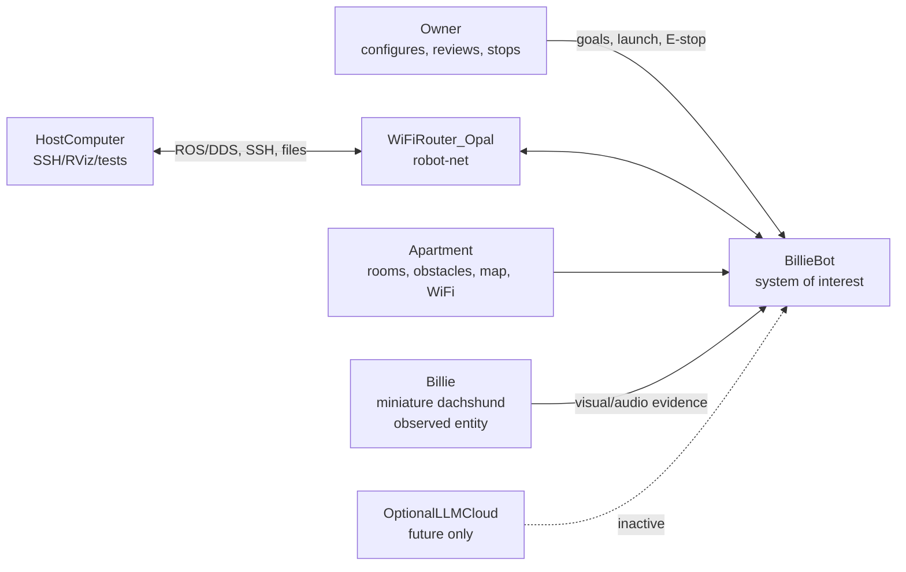

### 4.2 Context Blocks

| Block | Type | Responsibility | Key interfaces |
| --- | --- | --- | --- |
| `BillieBot` | System of interest | Mobile robot MVP, observation, logging, summary | ROS graph, physical sensors, drive base, network |
| `Billie` | External observed entity | Dog whose behavior/state is observed | Visual evidence, audio evidence, location context |
| `Owner` | Actor | Starts/stops robot, reviews summaries, provides supervision | Host commands, E-stop, summary review |
| `Apartment` | Environment | Operating area, obstacles, rooms, WiFi coverage | Map, obstacles, navigation constraints |
| `HostComputer` | External system | Development, RViz, SSH, test execution | Ethernet/WiFi, ROS 2 DDS, files |
| `WiFiRouter_Opal` | Enabling system | Local robot network | Ethernet/WiFi |
| `OptionalLLMCloud` | Future external system | Optional future summary enhancement | Inactive in MVP |

## 5. Requirements Decomposition

Requirement IDs are grouped by capability. Requirements marked "derived" expand the existing project and Cameo report requirements into verifiable statements.

### 5.1 Top-Level MVP Requirements

| ID | Requirement | Verification |
| --- | --- | --- |
| `REQ-MVP-001` | BillieBot shall autonomously navigate an apartment-scale environment using conservative motion limits. | `TC-012`, `TC-018`, `TC-020`, supervised run evidence |
| `REQ-MVP-002` | BillieBot shall maintain a map or localization representation sufficient for apartment navigation. | `TC-010`, `TC-011` |
| `REQ-MVP-003` | BillieBot shall execute a deterministic waypoint search route for Billie. | `TC-013` |
| `REQ-MVP-004` | BillieBot shall publish visual Billie/dog candidate detections from RGB/depth camera input or mock camera input. | `TC-006`, `TC-014` |
| `REQ-MVP-005` | BillieBot shall publish audio events for bark or loud-noise evidence from live or injected audio levels. | `TC-007`, `TC-015` |
| `REQ-MVP-006` | BillieBot shall classify and publish Billie state observations from visual, audio, and odometry evidence. | `TC-016`, topic evidence |
| `REQ-MVP-007` | BillieBot shall log observations with timestamp, confidence, evidence source, and raw JSON where applicable. | `TC-016` |
| `REQ-MVP-008` | BillieBot shall generate a deterministic local daily activity summary from SQLite event data. | `TC-017` |
| `REQ-MVP-009` | BillieBot shall not execute Behavior AI engagement actions in the MVP. | Model inspection, launch inspection |
| `REQ-MVP-010` | BillieBot shall provide reserved inactive interfaces for future Behavior AI integration. | Model inspection, interface matrix |

### 5.2 Navigation and Search Requirements

| ID | Requirement | Parent | Verification |
| --- | --- | --- | --- |
| `REQ-NAV-001` | BillieBot shall publish or consume `LaserScan` data on `/scan` for navigation perception. | `REQ-MVP-001`, `REQ-MVP-002` | `TC-004` |
| `REQ-NAV-002` | BillieBot shall provide an odometry frame `odom` and robot base frame `base_footprint`. | `REQ-MVP-001` | `TC-002`, `TC-003`, TF evidence |
| `REQ-NAV-003` | BillieBot shall support SLAM map publication on `/map` from `/scan` and `/odom`. | `REQ-MVP-002` | `TC-010` |
| `REQ-NAV-004` | BillieBot shall support AMCL localization using `map`, `odom`, `base_footprint`, and `/scan`. | `REQ-MVP-002` | `TC-011` |
| `REQ-NAV-005` | BillieBot shall provide Nav2 action servers for navigation goals when Nav2 is launched. | `REQ-MVP-001` | `TC-012` |
| `REQ-NAV-006` | BillieBot shall send deterministic search waypoints to Nav2 `follow_waypoints`. | `REQ-MVP-003` | `TC-013` |
| `REQ-NAV-007` | BillieBot shall load search waypoints from a YAML file containing map-frame poses. | `REQ-MVP-003` | `TC-013` |
| `REQ-NAV-008` | BillieBot shall report route acceptance, completion, or missed waypoints in the search node logs. | `REQ-MVP-003` | `TC-013` log evidence |
| `REQ-NAV-009` | BillieBot shall execute Nav2 recovery behaviors or report structured failure when blocked. | `REQ-MVP-001` | `TC-020` |
| `REQ-NAV-010` | BillieBot shall expose navigation status through Nav2 action results, topics, logs, or test output. | `REQ-MVP-001` | `TC-012`, `TC-013`, `TC-020` |

### 5.3 Mobility and Drive Requirements

| ID | Requirement | Parent | Verification |
| --- | --- | --- | --- |
| `REQ-MOB-001` | BillieBot shall accept velocity commands on `/cmd_vel` before safety supervision. | `REQ-MVP-001` | `TC-001`, `TC-008`, `TC-019` |
| `REQ-MOB-002` | BillieBot shall forward only safety-supervised velocity commands on `/cmd_vel_safe` to the drive base. | `REQ-SAFE-001` | `TC-019` |
| `REQ-MOB-003` | BillieBot shall convert safe body velocity commands into left/right wheel angular speeds. | `REQ-MVP-001` | `TC-001`, `TC-008` |
| `REQ-MOB-004` | BillieBot shall convert wheel angular speeds into Arduino motor commands `m L R` in counts per PID loop. | `REQ-MVP-001` | `TC-001`, serial evidence |
| `REQ-MOB-005` | BillieBot shall read Arduino encoder counts using the `e` command. | `REQ-MVP-001` | `TC-002` |
| `REQ-MOB-006` | BillieBot shall reset Arduino encoder counts on startup when configured. | `REQ-MVP-001` | Drive launch log evidence |
| `REQ-MOB-007` | BillieBot shall publish `/odom` from encoder-derived differential-drive integration. | `REQ-MVP-001` | `TC-002`, `TC-003`, `TC-008` |
| `REQ-MOB-008` | BillieBot shall publish `/joint_states` for left and right wheel joints. | `REQ-MVP-001` | topic evidence |
| `REQ-MOB-009` | BillieBot shall publish `odom -> base_footprint` TF when configured. | `REQ-MVP-001` | TF evidence |
| `REQ-MOB-010` | BillieBot shall support calibration of wheel radius, wheel separation, encoder ticks, and motor/encoder signs. | `REQ-MVP-001` | `TC-008`, `TC-009` |
| `REQ-MOB-011` | BillieBot shall provide mock drive behavior without opening a serial port. | `REQ-IF-006` | Mock smoke tests |

### 5.4 Visual Perception Requirements

| ID | Requirement | Parent | Verification |
| --- | --- | --- | --- |
| `REQ-VIS-001` | BillieBot shall publish RGB image data on `/oak/rgb/image_raw` in hardware or mock camera mode. | `REQ-MVP-004` | `TC-006` |
| `REQ-VIS-002` | BillieBot shall publish depth image data on `/oak/stereo/depth` in hardware or mock camera mode. | `REQ-MVP-004` | `TC-006` |
| `REQ-VIS-003` | BillieBot shall publish camera info on `/oak/rgb/camera_info` in mock camera mode. | `REQ-MVP-004` | topic evidence |
| `REQ-VIS-004` | BillieBot shall produce `BillieDetectionArray` messages on `/billie/detections`. | `REQ-MVP-004` | `TC-014` |
| `REQ-VIS-005` | Each `BillieDetection` shall include detector name, class label, confidence, bounding box, range, bearing, pose, and candidate flag. | `REQ-MVP-004` | message inspection, `TC-014` |
| `REQ-VIS-006` | BillieBot shall filter detections using `confidence_threshold` and `is_billie_candidate`. | `REQ-MVP-004`, `REQ-MVP-006` | `TC-014`, node inspection |
| `REQ-VIS-007` | BillieBot shall support mock detection publication for CI and no-hardware tests. | `REQ-IF-006` | `TC-014`, smoke tests |
| `REQ-VIS-008` | BillieBot shall keep real detector model backends as extension points without claiming active production detection. | `REQ-MVP-009` | model and launch inspection |
| `REQ-VIS-009` | BillieBot shall optionally publish `/billie/detections/debug_image` when configured. | `REQ-MVP-004` | parameter/topic evidence |
| `REQ-VIS-010` | BillieBot shall support a visual-state helper that maps detections into visual observations on `/billie/visual_state`. | `REQ-MVP-006` | topic evidence |

### 5.5 Audio Perception Requirements

| ID | Requirement | Parent | Verification |
| --- | --- | --- | --- |
| `REQ-AUD-001` | BillieBot shall publish `AudioEvent` messages on `/billie/audio_events`. | `REQ-MVP-005` | `TC-007`, `TC-015` |
| `REQ-AUD-002` | BillieBot shall accept injected loudness values on `/billiebot/audio_level_db` for portable verification. | `REQ-MVP-005` | `TC-007`, `TC-015` |
| `REQ-AUD-003` | BillieBot shall classify loudness above threshold plus margin as `bark` in threshold mode. | `REQ-MVP-005` | `TC-015` |
| `REQ-AUD-004` | BillieBot shall classify loudness above threshold but below bark margin as `loud_noise`. | `REQ-MVP-005` | targeted audio test |
| `REQ-AUD-005` | BillieBot shall include event type, confidence, loudness, duration, and DoA in every `AudioEvent`. | `REQ-MVP-005` | message inspection |
| `REQ-AUD-006` | BillieBot shall support mock audio event publication for no-hardware tests. | `REQ-IF-006` | smoke tests |
| `REQ-AUD-007` | BillieBot shall support optional direct audio capture when `sounddevice` and `numpy` are available. | `REQ-MVP-005` | hardware audio test |
| `REQ-AUD-008` | BillieBot shall enforce minimum event duration and cooldown before publishing repeated events. | `REQ-MVP-005` | node inspection, targeted test |

### 5.6 State Estimation Requirements

| ID | Requirement | Parent | Verification |
| --- | --- | --- | --- |
| `REQ-STATE-001` | BillieBot shall subscribe to `/billie/detections`, `/billie/audio_events`, and `/odom` for state estimation. | `REQ-MVP-006` | launch/topic evidence |
| `REQ-STATE-002` | BillieBot shall publish `BillieStateObservation` on `/billie/state` at configured rate. | `REQ-MVP-006` | topic evidence, `TC-016` |
| `REQ-STATE-003` | BillieBot shall publish `not_seen` when visual detections are absent or timed out. | `REQ-MVP-006` | targeted state test |
| `REQ-STATE-004` | BillieBot shall publish `seen` when a valid visual candidate is recent but not moving or sleeping. | `REQ-MVP-006` | targeted state test |
| `REQ-STATE-005` | BillieBot shall publish `moving` when visual estimated pose or bearing change exceeds threshold. | `REQ-MVP-006` | targeted state test |
| `REQ-STATE-006` | BillieBot shall publish `sleeping` when visual evidence remains stationary for configured duration. | `REQ-MVP-006` | targeted state test |
| `REQ-STATE-007` | BillieBot shall prefer recent bark or loud-noise audio state over visual state for `barking` and `loud_noise`. | `REQ-MVP-006` | `TC-015`, targeted state test |
| `REQ-STATE-008` | BillieBot shall publish `unknown` when recent audio is unknown and visual confidence is low. | `REQ-MVP-006` | targeted state test |
| `REQ-STATE-009` | Each state observation shall include state label, confidence, evidence source, robot pose, estimated Billie pose, and media reference field. | `REQ-MVP-006` | message inspection |

### 5.7 Logging and Summary Requirements

| ID | Requirement | Parent | Verification |
| --- | --- | --- | --- |
| `REQ-LOG-001` | BillieBot shall create or open a SQLite database at configured `database_path`. | `REQ-MVP-007` | `TC-016` |
| `REQ-LOG-002` | BillieBot shall create tables `events`, `detections`, `audio_events`, and `daily_summaries`. | `REQ-MVP-007`, `REQ-MVP-008` | `TC-016`, `TC-017` |
| `REQ-LOG-003` | BillieBot shall log state observations into `events` as `state_observation`. | `REQ-MVP-007` | `TC-016` |
| `REQ-LOG-004` | BillieBot shall log detection arrays into `detections` when configured. | `REQ-MVP-007` | logger test or DB inspection |
| `REQ-LOG-005` | BillieBot shall log audio events into `audio_events` when configured. | `REQ-MVP-007` | logger test or DB inspection |
| `REQ-LOG-006` | BillieBot shall log `/billiebot/health` strings into `events` as `health`. | `REQ-MVP-007` | targeted health log test |
| `REQ-LOG-007` | BillieBot shall publish `EventLogStatus` on `/billie/events_logged` after log attempts. | `REQ-MVP-007` | `TC-016` |
| `REQ-SUM-001` | BillieBot shall compute daily summary counts for detections, barks, loud noises, resting/sleeping, locations, and navigation/safety issues. | `REQ-MVP-008` | `TC-017` |
| `REQ-SUM-002` | BillieBot shall write a local Markdown summary file. | `REQ-MVP-008` | `TC-017` |
| `REQ-SUM-003` | BillieBot shall upsert a `daily_summaries` row for the summary date. | `REQ-MVP-008` | `TC-017` |
| `REQ-SUM-004` | BillieBot summaries shall be deterministic and generated only from local SQLite events in the MVP. | `REQ-MVP-008`, `REQ-MVP-009` | `TC-017`, model inspection |

### 5.8 Safety Requirements

| ID | Requirement | Parent | Verification |
| --- | --- | --- | --- |
| `REQ-SAFE-001` | BillieBot shall limit linear and angular velocities before commands reach the drive base. | `REQ-MVP-001` | `TC-019` |
| `REQ-SAFE-002` | BillieBot shall publish zero velocity when no command is received within `command_timeout_sec`. | `REQ-MVP-001` | targeted timeout test |
| `REQ-SAFE-003` | BillieBot shall support software E-stop through `/billiebot/estop`. | `REQ-MVP-001` | targeted E-stop topic test |
| `REQ-SAFE-004` | BillieBot shall support software E-stop through `/billiebot/set_estop`. | `REQ-MVP-001` | `TC-019` |
| `REQ-SAFE-005` | BillieBot shall publish `SystemMode` on `/billiebot/mode` with mode and reason. | `REQ-MVP-001`, `REQ-MVP-007` | topic evidence |
| `REQ-SAFE-006` | BillieBot shall publish mode `active` only when forwarding a fresh safe command. | `REQ-MVP-001` | targeted mode test |
| `REQ-SAFE-007` | BillieBot shall publish mode `idle` when command timeout occurs. | `REQ-MVP-001` | targeted mode test |
| `REQ-SAFE-008` | BillieBot shall publish mode `estop` when E-stop is active. | `REQ-MVP-001` | `TC-019` |
| `REQ-SAFE-009` | BillieBot shall not intentionally contact Billie during MVP operation. | `REQ-MVP-001`, `REQ-MVP-009` | `TC-020`, supervised run |
| `REQ-SAFE-010` | BillieBot shall fail safe on stopped command stream by commanding zero motor speed. | `REQ-MVP-001` | timeout test, drive inspection |
| `REQ-SAFE-011` | BillieBot shall preserve safety supervision as the final gate before motor control, including future command producers. | `REQ-MVP-010` | IBD inspection |

### 5.9 Interface, Configuration, and Mock-Mode Requirements

| ID | Requirement | Parent | Verification |
| --- | --- | --- | --- |
| `REQ-IF-001` | BillieBot shall provide launch files for incremental bring-up of description, lidar, drive, SLAM, AMCL, Nav2, OAK-D, vision, audio, state, logging, and summary. | all MVP | launch inspection |
| `REQ-IF-002` | BillieBot shall provide an integrated `mvp_full.launch.py` for mock/default MVP graph integration. | all MVP | smoke tests |
| `REQ-IF-003` | BillieBot shall support configurable serial paths for Arduino and RPLidar. | `REQ-MOB-004`, `REQ-NAV-001` | launch/config inspection |
| `REQ-IF-004` | BillieBot shall support configurable camera topic names for OAK-D driver differences. | `REQ-VIS-001` | `TC-006` parameters |
| `REQ-IF-005` | BillieBot shall support configurable audio device and injected audio-level operation. | `REQ-AUD-001` | `TC-007` |
| `REQ-IF-006` | BillieBot shall support mock hardware, mock lidar, mock camera, mock detection, and mock audio event paths. | MVP testability | smoke tests |
| `REQ-IF-007` | BillieBot shall expose custom messages through `billiebot_msgs` for detection, audio, state, log status, and mode. | all observation features | message build and inspection |
| `REQ-IF-008` | BillieBot shall use ROS topic names consistently with README launch documentation. | all MVP | launch/topic inspection |

### 5.10 Future Reserved Requirements

| ID | Requirement | MVP status | Verification |
| --- | --- | --- | --- |
| `REQ-FUT-001` | BillieBot shall reserve future Behavior AI context interfaces. | Inactive | IBD-06 inspection |
| `REQ-FUT-002` | BillieBot shall reserve future engagement action interfaces. | Inactive | IBD-06 inspection |
| `REQ-FUT-003` | BillieBot shall reserve future learning and reward model blocks. | Inactive | package inspection |
| `REQ-FUT-004` | BillieBot shall reserve future stress estimation interfaces. | Inactive | package inspection |
| `REQ-FUT-005` | BillieBot shall prevent future policy output from bypassing safety supervision. | Inactive design constraint | IBD-06 inspection |
| `REQ-FUT-006` | BillieBot shall not verify future inactive functions as MVP capabilities. | Inactive design constraint | verification matrix inspection |

## 6. Block Architecture

### 6.1 Logical Blocks

```mermaid
flowchart TB
    BillieBot["BillieBot"]
    BillieBot --> Compute["ComputeSubsystem"]
    BillieBot --> Communication["CommunicationSubsystem"]
    BillieBot --> Power["PowerSubsystem"]
    BillieBot --> Mobility["MobilitySubsystem"]
    BillieBot --> Safety["SafetySubsystem"]
    BillieBot --> Navigation["NavigationSubsystem"]
    BillieBot --> Visual["VisualPerceptionSubsystem"]
    BillieBot --> Audio["AudioPerceptionSubsystem"]
    BillieBot --> State["StateEstimationSubsystem"]
    BillieBot --> Logging["EventLoggingSubsystem"]
    BillieBot --> Summary["DailySummarySubsystem"]
    BillieBot -. reserved .-> Future["FutureBehaviorAISubsystem<br>inactive"]
```

| Logical block | Responsibilities | Satisfies |
| --- | --- | --- |
| `ComputeSubsystem` | Hosts ROS 2 graph, launch files, local storage, and node execution | `REQ-IF-001`, `REQ-IF-002` |
| `CommunicationSubsystem` | Provides host-to-robot network and ROS DDS connectivity | `REQ-IF-001` |
| `PowerSubsystem` | Provides power rails and battery-backed robot operation | `REQ-SAFE-009`, hardware support |
| `MobilitySubsystem` | Converts velocity commands to wheel motion, publishes odometry and joint state | `REQ-MOB-*` |
| `SafetySubsystem` | Clamps commands, times out stale commands, handles E-stop, publishes mode | `REQ-SAFE-*` |
| `NavigationSubsystem` | Lidar, SLAM, AMCL, Nav2, waypoint search, recovery | `REQ-NAV-*` |
| `VisualPerceptionSubsystem` | Camera stream, detection array, optional visual state | `REQ-VIS-*` |
| `AudioPerceptionSubsystem` | Audio level ingest, bark/loud-noise classification, audio events | `REQ-AUD-*` |
| `StateEstimationSubsystem` | Rule-based fusion into Billie state observations | `REQ-STATE-*` |
| `EventLoggingSubsystem` | SQLite persistence and log status publication | `REQ-LOG-*` |
| `DailySummarySubsystem` | Deterministic local report generation from SQLite | `REQ-SUM-*` |
| `FutureBehaviorAISubsystem` | Reserved future context/action/policy interfaces only | `REQ-FUT-*` |

### 6.2 Physical and Software Blocks

| Block | Type | Allocation / source |
| --- | --- | --- |
| `JetsonOrinNano` | Physical compute | Hosts ROS 2 Humble workspace |
| `ArduinoNano` | Physical microcontroller | Runs `ROSArduinoBridge` firmware |
| `DifferentialDriveBase` | Physical/mobile base | Two DC encoder motors, wheels, caster |
| `L298NMotorDriver` | Physical motor driver | PWM/DIR/EN from Arduino, motor power switching |
| `RPLidarA1` | Physical sensor | Source for `/scan` |
| `OAKDLite` | Physical sensor | Source for RGB/depth topics |
| `ReSpeakerXVF3800` | Physical sensor | Source for audio stream or audio-level evidence |
| `BNO055_BMP280_IMU` | Physical sensor | Modeled in URDF, no MVP fusion node |
| `SQLiteEventDatabase` | Data store | `events`, `detections`, `audio_events`, `daily_summaries` |
| `diff_drive_base` | ROS node | `billiebot_control` |
| `safety_supervisor_node` | ROS node | `billiebot_safety` |
| `mock_lidar_node` | ROS node | `billiebot_navigation` |
| `waypoint_search_node` | ROS node | `billiebot_navigation` |
| `rplidar_node` | ROS node | `rplidar_ros` |
| `slam_toolbox` | ROS node/group | SLAM Toolbox |
| `amcl` | ROS node | Nav2 AMCL |
| `Nav2Stack` | ROS node group | BT navigator, controller, planner, behavior server, waypoint follower, velocity smoother |
| `mock_camera_node` | ROS node | `billiebot_perception` |
| `oak` | ROS node | `depthai_ros_driver` |
| `billie_detector_node` | ROS node | `billiebot_perception` |
| `visual_state_node` | ROS node | `billiebot_perception` |
| `audio_event_node` | ROS node | `billiebot_audio` |
| `billie_state_estimator` | ROS node | `billiebot_state` |
| `event_logger_node` | ROS node | `billiebot_logging` |
| `daily_summary_node` | ROS node | `billiebot_summary` |
| `generate_daily_summary` | CLI/function | `billiebot_summary` |

### 6.3 Block-to-Node Allocation

| Logical block | Software nodes | Physical host |
| --- | --- | --- |
| `MobilitySubsystem` | `diff_drive_base`, Arduino firmware | Jetson + Arduino Nano + drive base |
| `SafetySubsystem` | `safety_supervisor_node` | Jetson |
| `NavigationSubsystem` | `mock_lidar_node`, `rplidar_node`, `slam_toolbox`, `amcl`, Nav2 nodes, `waypoint_search_node` | Jetson + RPLidar |
| `VisualPerceptionSubsystem` | `mock_camera_node`, `oak`, `billie_detector_node`, `visual_state_node` | Jetson + OAK-D Lite |
| `AudioPerceptionSubsystem` | `audio_event_node` | Jetson + ReSpeaker |
| `StateEstimationSubsystem` | `billie_state_estimator` | Jetson |
| `EventLoggingSubsystem` | `event_logger_node` | Jetson + local filesystem |
| `DailySummarySubsystem` | `daily_summary_node`, `generate_daily_summary` | Jetson + local filesystem |
| `CommunicationSubsystem` | ROS 2 DDS, SSH, RViz, router | Jetson + Opal + host |
| `FutureBehaviorAISubsystem` | none active in MVP | future only |

## 7. Interface Blocks and Signals

Create each row as a SysML interface block or item flow in `05_Interfaces`.

### 7.1 ROS Topic and Service Flows

| Interface block / item flow | Source block | Destination block | Interface | Signal / message |
| --- | --- | --- | --- | --- |
| `VelocityCommandFlow` | Nav2, teleop, tests, future policy | `SafetySubsystem` | ROS topic `/cmd_vel` | `geometry_msgs/Twist` |
| `SafeVelocityCommandFlow` | `SafetySubsystem` | `MobilitySubsystem` | ROS topic `/cmd_vel_safe` | `geometry_msgs/Twist` |
| `SystemModeFlow` | `SafetySubsystem` | Logger, future AI, owner tools | ROS topic `/billiebot/mode` | `billiebot_msgs/SystemMode` |
| `SoftwareEStopTopicFlow` | Owner/test/future safety | `SafetySubsystem` | ROS topic `/billiebot/estop` | `std_msgs/Bool` |
| `SoftwareEStopServiceFlow` | Owner/test/future safety | `SafetySubsystem` | ROS service `/billiebot/set_estop` | `std_srvs/SetBool` |
| `WheelOdometryFlow` | `MobilitySubsystem` | Navigation, state estimator, tests | ROS topic `/odom` | `nav_msgs/Odometry` |
| `WheelJointStateFlow` | `MobilitySubsystem` | robot state publisher/RViz | ROS topic `/joint_states` | `sensor_msgs/JointState` |
| `TfFlow` | Description, drive, localization | navigation and perception consumers | ROS topic `/tf` | `tf2_msgs/TFMessage` |
| `LaserScanFlow` | RPLidar/mock lidar | SLAM, AMCL, Nav2 | ROS topic `/scan` | `sensor_msgs/LaserScan` |
| `MapFlow` | SLAM/map server | Nav2, AMCL, RViz | ROS topic `/map` | `nav_msgs/OccupancyGrid` |
| `AmclPoseFlow` | AMCL | Nav2/RViz/tests | ROS topic `/amcl_pose` | `geometry_msgs/PoseWithCovarianceStamped` |
| `NavigateToPoseActionFlow` | Tests/RViz/owner tools | Nav2 | ROS action `navigate_to_pose` | `nav2_msgs/NavigateToPose` |
| `FollowWaypointsActionFlow` | `waypoint_search_node` | Nav2 waypoint follower | ROS action `follow_waypoints` | `nav2_msgs/FollowWaypoints` |
| `RgbImageFlow` | OAK-D/mock camera | detector/test | ROS topic `/oak/rgb/image_raw` | `sensor_msgs/Image` |
| `DepthImageFlow` | OAK-D/mock camera | detector/test | ROS topic `/oak/stereo/depth` | `sensor_msgs/Image` |
| `CameraInfoFlow` | OAK-D/mock camera | perception consumers | ROS topic `/oak/rgb/camera_info` | `sensor_msgs/CameraInfo` |
| `BillieDetectionFlow` | detector | state estimator, logger, future AI | ROS topic `/billie/detections` | `BillieDetectionArray` |
| `DebugImageFlow` | detector | RViz/debug tools | ROS topic `/billie/detections/debug_image` | `sensor_msgs/Image` |
| `AudioLevelFlow` | test/audio frontend | audio event node | ROS topic `/billiebot/audio_level_db` | `std_msgs/Float32` |
| `AudioEventFlow` | audio event node | state estimator, logger, future AI | ROS topic `/billie/audio_events` | `AudioEvent` |
| `VisualStateFlow` | visual state helper | logger/debug/future | ROS topic `/billie/visual_state` | `BillieStateObservation` |
| `StateObservationFlow` | state estimator | logger, future AI, owner tools | ROS topic `/billie/state` | `BillieStateObservation` |
| `EventLogStatusFlow` | logger | tests/owner tools | ROS topic `/billie/events_logged` | `EventLogStatus` |
| `HealthEventFlow` | health publisher/future monitors | logger | ROS topic `/billiebot/health` | `std_msgs/String` |

### 7.2 Hardware and Serial Flows

| Interface block / item flow | Source block | Destination block | Interface | Signal |
| --- | --- | --- | --- | --- |
| `UsbSerialMotorCommandFlow` | Jetson `diff_drive_base` | Arduino Nano | USB serial, 57600 baud, CR terminated | `m L R`, `e`, `r` |
| `ArduinoEncoderReplyFlow` | Arduino Nano | Jetson `diff_drive_base` | USB serial | two encoder count integers |
| `MotorPwmDirectionEnableFlow` | Arduino Nano | L298N | GPIO/PWM harness | D5, D6, D9, D10, D12, D13 |
| `MotorPhasePowerFlow` | L298N | Left/right motors | motor power terminals | switched bidirectional motor voltage |
| `EncoderQuadratureFlow` | Wheel encoders | Arduino Nano | digital inputs | left D2/D3, right A4/A5 |
| `UsbLidarFlow` | RPLidar A1 adapter | Jetson | USB serial, 115200 baud | lidar packets |
| `UsbCameraFlow` | OAK-D Lite | Jetson | USB3 | RGB/depth/control |
| `UsbAudioFlow` | ReSpeaker XVF3800 | Jetson | USB audio | audio samples/features |
| `EthernetRobotNetworkFlow` | Jetson/host/router | Jetson/host/router | Ethernet/WiFi | SSH, ROS DDS, files |
| `VbatPowerFlow` | 3S LiPo/power bus | Jetson/motor/regulator branches | DC power | 9.0-12.6 V |
| `Regulated5VFlow` | 5 V regulator | router/accessories | DC power | 5V_SYS |
| `CommonGroundReferenceFlow` | power bus | Arduino, L298N, sensors | electrical reference | ground |

### 7.3 Custom Message Schemas

Model these as value types or interface block payload definitions.

| Message | Fields |
| --- | --- |
| `AudioEvent` | `header`, `event_type`, `confidence`, `loudness_db`, `duration_s`, `doa_rad` |
| `BillieDetection` | `header`, `detector_name`, `class_label`, `confidence`, `bbox_x`, `bbox_y`, `bbox_width`, `bbox_height`, `range_m`, `bearing_rad`, `estimated_pose`, `is_billie_candidate` |
| `BillieDetectionArray` | `header`, `detections[]` |
| `BillieStateObservation` | `header`, `state_label`, `confidence`, `evidence_source`, `robot_pose`, `estimated_billie_pose`, `media_reference` |
| `EventLogStatus` | `header`, `success`, `database_path`, `message` |
| `SystemMode` | `header`, `mode`, `reason` |

## 8. Internal Block Diagrams

### 8.1 `IBD-01 MVP Data and Control Flow`

Purpose: show the complete active MVP software/hardware data path.

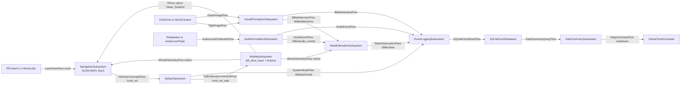

Cameo parts:

| Part | Type |
| --- | --- |
| `navigation` | `NavigationSubsystem` |
| `safety` | `SafetySubsystem` |
| `mobility` | `MobilitySubsystem` |
| `visualPerception` | `VisualPerceptionSubsystem` |
| `audioPerception` | `AudioPerceptionSubsystem` |
| `stateEstimator` | `StateEstimationSubsystem` |
| `eventLogger` | `EventLoggingSubsystem` |
| `dailySummary` | `DailySummarySubsystem` |
| `eventDb` | `SQLiteEventDatabase` |
| `ownerHost` | `Owner` / `HostComputer` |

Key connectors and item flows:

| Connector | Item flow | Requirements demonstrated |
| --- | --- | --- |
| `navigation -> safety` | `VelocityCommandFlow` | `REQ-MOB-001`, `REQ-SAFE-011` |
| `safety -> mobility` | `SafeVelocityCommandFlow` | `REQ-MOB-002`, `REQ-SAFE-001` |
| `mobility -> navigation` | `WheelOdometryFlow`, `TfFlow` | `REQ-MOB-007`, `REQ-NAV-002` |
| `lidar -> navigation` | `LaserScanFlow` | `REQ-NAV-001` |
| `camera -> visualPerception` | `RgbImageFlow`, `DepthImageFlow` | `REQ-VIS-001`, `REQ-VIS-002` |
| `visualPerception -> stateEstimator` | `BillieDetectionFlow` | `REQ-VIS-004`, `REQ-STATE-001` |
| `audioPerception -> stateEstimator` | `AudioEventFlow` | `REQ-AUD-001`, `REQ-STATE-001` |
| `stateEstimator -> eventLogger` | `StateObservationFlow` | `REQ-STATE-002`, `REQ-LOG-003` |
| `eventLogger -> eventDb` | `SQLiteEventStoreFlow` | `REQ-LOG-001`, `REQ-LOG-002` |
| `eventDb -> dailySummary` | `DailySummaryQueryFlow` | `REQ-SUM-001` |

### 8.2 `IBD-02 Drive and Safety Control Path`

Purpose: demonstrate that all motion commands pass through safety before motor actuation.

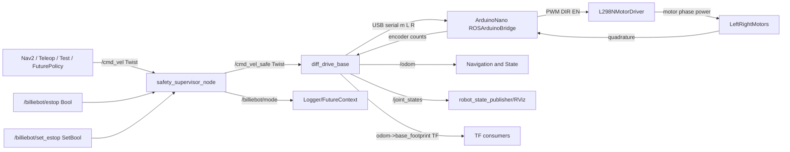

Cameo ports:

| Block | Port | Direction | Interface |
| --- | --- | --- | --- |
| `SafetySubsystem` | `cmdVelIn` | in | `VelocityCommandFlow` |
| `SafetySubsystem` | `safeCmdOut` | out | `SafeVelocityCommandFlow` |
| `SafetySubsystem` | `estopTopicIn` | in | `SoftwareEStopTopicFlow` |
| `SafetySubsystem` | `estopServiceIn` | inout | `SoftwareEStopServiceFlow` |
| `SafetySubsystem` | `modeOut` | out | `SystemModeFlow` |
| `MobilitySubsystem` | `safeCmdIn` | in | `SafeVelocityCommandFlow` |
| `MobilitySubsystem` | `arduinoSerial` | inout | `UsbSerialMotorCommandFlow`, `ArduinoEncoderReplyFlow` |
| `MobilitySubsystem` | `odomOut` | out | `WheelOdometryFlow` |
| `MobilitySubsystem` | `jointStateOut` | out | `WheelJointStateFlow` |
| `ArduinoNano` | `motorIoOut` | out | `MotorPwmDirectionEnableFlow` |
| `ArduinoNano` | `encoderIn` | in | `EncoderQuadratureFlow` |

Requirements demonstrated:

- `REQ-MOB-001` through `REQ-MOB-011`
- `REQ-SAFE-001` through `REQ-SAFE-011`
- `REQ-FUT-005`

### 8.3 `IBD-03 Perception and State Fusion`

Purpose: show how visual and audio evidence become Billie state observations.

```mermaid
flowchart TB
    OAK["OAKDLite / mock_camera_node"] -->|/oak/rgb/image_raw| Detector["billie_detector_node"]
    OAK -->|/oak/stereo/depth| Detector
    Detector -->|/billie/detections<br>BillieDetectionArray| State["billie_state_estimator"]
    Detector -. optional .->|/billie/detections/debug_image| Debug["Debug consumer"]

    AudioInput["ReSpeaker / audio_level_db / mock"] --> Audio["audio_event_node"]
    Audio -->|/billie/audio_events<br>AudioEvent| State

    Drive["diff_drive_base"] -->|/odom| State
    State -->|/billie/state<br>BillieStateObservation| Logger["event_logger_node"]
    State -->|/billie/state| Future["FutureBehaviorAI<br>inactive"]
    Detector -->|/billie/detections| Logger
    Audio -->|/billie/audio_events| Logger

    Detector --> VisualHelper["visual_state_node optional"]
    VisualHelper -->|/billie/visual_state| Logger
```

Decision points represented in the IBD notes:

| Decision | Source code behavior |
| --- | --- |
| Detector backend | `mock`, `opencv` placeholder, `ultralytics` extension point |
| Detection candidate | `is_billie_candidate == true` and confidence >= threshold |
| Audio event type | `bark` when loudness >= threshold + 8 dB, else `loud_noise`; `unknown` for unsupported model state |
| State precedence | Recent `bark` or `loud_noise` audio overrides visual classification |
| Visual timeout | stale detections become `not_seen` or `unknown` depending node |

Requirements demonstrated:

- `REQ-VIS-*`
- `REQ-AUD-*`
- `REQ-STATE-*`
- `REQ-MVP-004`, `REQ-MVP-005`, `REQ-MVP-006`

### 8.4 `IBD-04 Logging and Summary Data Path`

Purpose: show persistent event storage and deterministic summary generation.

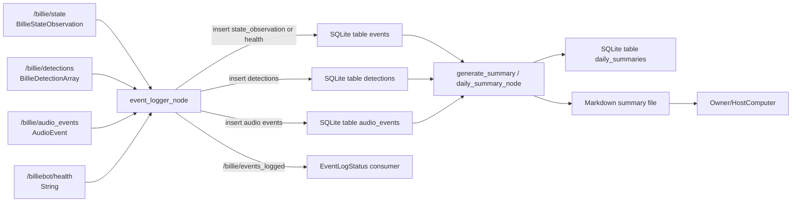

SQLite tables:

| Table | Key fields |
| --- | --- |
| `events` | `stamp`, `event_type`, `state_label`, `confidence`, `evidence_source`, `robot_x`, `robot_y`, `billie_x`, `billie_y`, `media_reference`, `raw_json` |
| `detections` | `stamp`, `detector_name`, `class_label`, `confidence`, `bbox_x`, `bbox_y`, `bbox_width`, `bbox_height`, `range_m`, `bearing_rad`, `is_billie_candidate`, `raw_json` |
| `audio_events` | `stamp`, `event_type`, `confidence`, `loudness_db`, `duration_s`, `doa_rad`, `raw_json` |
| `daily_summaries` | `summary_date`, `generated_at`, `output_path`, `summary_text` |

Requirements demonstrated:

- `REQ-LOG-*`
- `REQ-SUM-*`
- `REQ-MVP-007`, `REQ-MVP-008`

### 8.5 `IBD-05 Hardware, Power, and Communication Interfaces`

Purpose: model physical deployment interfaces that constrain the software flows.

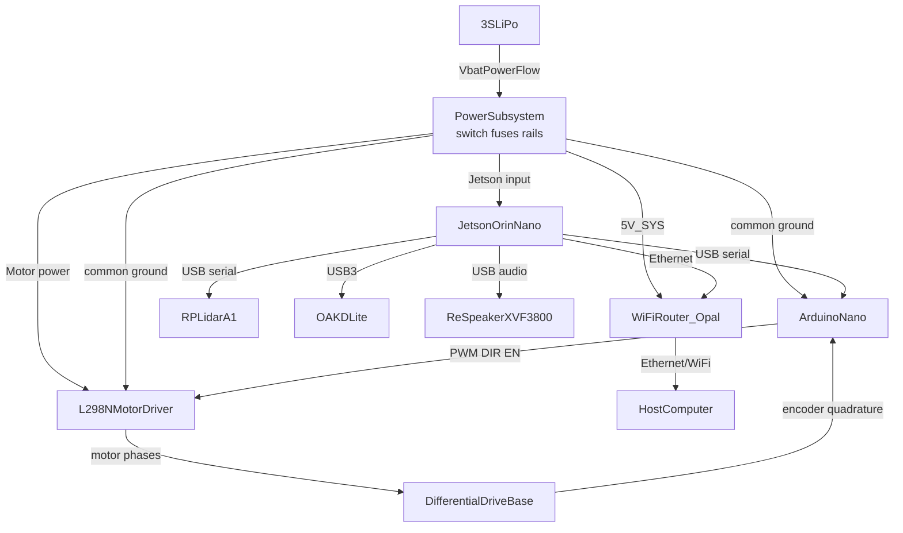

Requirements demonstrated:

- `REQ-IF-003`, `REQ-IF-004`, `REQ-IF-005`
- `REQ-MOB-004`, `REQ-MOB-005`
- `REQ-NAV-001`
- `REQ-VIS-001`, `REQ-VIS-002`
- `REQ-AUD-001`

### 8.6 `IBD-06 Future Behavior AI Reserved Interfaces`

Purpose: show future integration points without making future behavior active in the MVP.

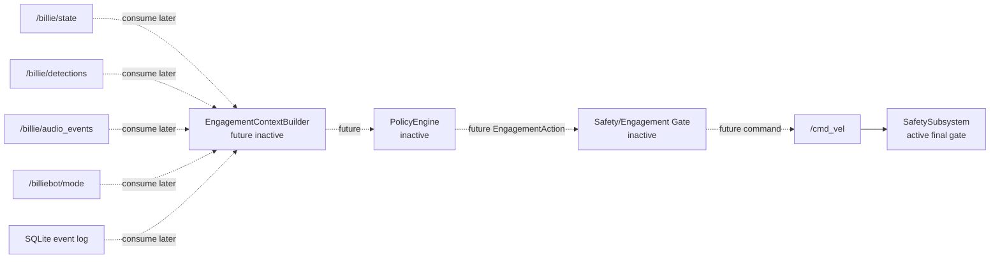

Rules for Cameo:

1. Put all future blocks in `07_Future_Growth`.
2. Mark all future parts as `inactive/reserved`.
3. Do not allocate any MVP launch file or executable node to future Behavior AI.
4. All future motion-producing commands must flow to `/cmd_vel`, then through `SafetySubsystem`.
5. Do not create a verify relationship from MVP test cases to future functions, except model-inspection tests for reserved interface presence.

Requirements demonstrated:

- `REQ-MVP-009`
- `REQ-MVP-010`
- `REQ-FUT-001` through `REQ-FUT-006`

## 9. Activity Diagrams

Use Activity Diagrams with partitions. Each activity below includes a Mermaid preview and a Cameo construction table.

### 9.1 `ACT-01 ExecuteMvpAutonomousMission`

Purpose: top-level MVP behavior from launch through search, evidence collection, logging, and summary readiness.

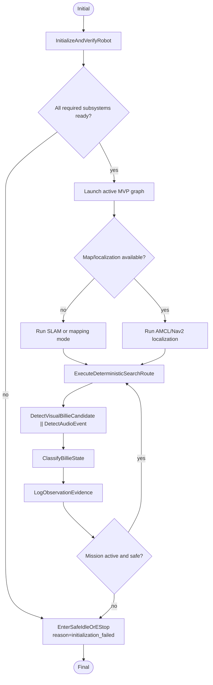

Cameo construction:

| Element | Detail |
| --- | --- |
| Partitions | Owner/Host, Bringup, Navigation, Perception, State/Logging, Safety |
| Call actions | `InitializeAndVerifyRobot`, `ExecuteDeterministicSearchRoute`, `DetectVisualBillieCandidate`, `DetectAudioEvent`, `ClassifyBillieState`, `LogObservationEvidence`, `EnterSafeIdleOrEStop` |
| Guards | `[all required topics available]`, `[missing required subsystem]`, `[map/localization available]`, `[mission active and safe]` |
| Object flows | `SystemMode`, `LaserScan`, `Odometry`, `BillieDetectionArray`, `AudioEvent`, `BillieStateObservation`, `EventLogStatus` |
| Refines | `REQ-MVP-001` through `REQ-MVP-009` |

### 9.2 `ACT-02 InitializeAndVerifyRobot`

Purpose: represent staged startup checks in a model-verifiable form.

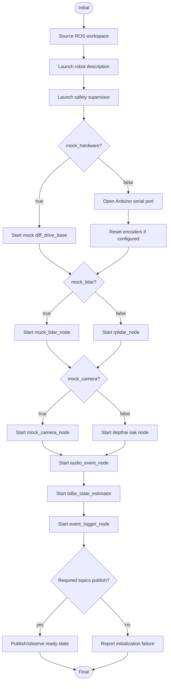

Cameo construction:

| Element | Detail |
| --- | --- |
| Partitions | HostComputer, ComputeSubsystem, MobilitySubsystem, NavigationSubsystem, VisualPerceptionSubsystem, AudioPerceptionSubsystem, State/Logging |
| Guards | `[mock_hardware]`, `[hardware]`, `[mock_lidar]`, `[mock_camera]`, `[required topics publish]` |
| Outputs | Ready/failed status, initial topics |
| Refines | `REQ-IF-001`, `REQ-IF-002`, `REQ-IF-006` |

### 9.3 `ACT-03 EnforceSafeMotion`

Purpose: show velocity clamp, timeout, stop mode, and E-stop behavior.

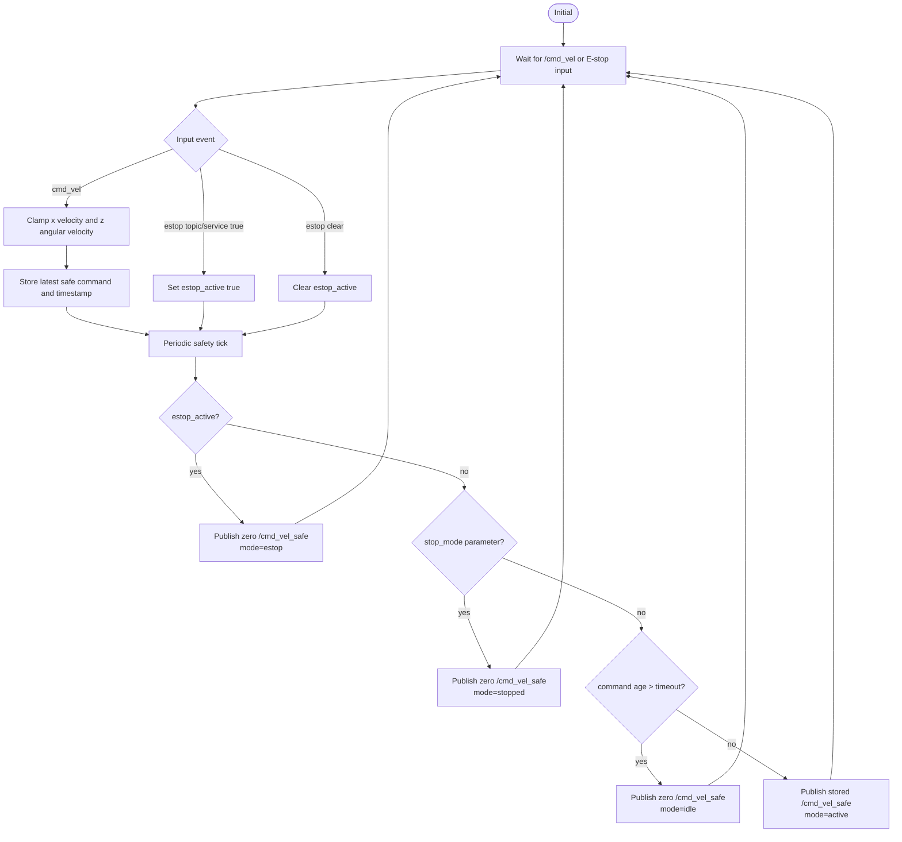

Cameo construction:

| Element | Detail |
| --- | --- |
| Partitions | CommandProducer, SafetySubsystem, MobilitySubsystem |
| Guards | `[estop_active]`, `[stop_mode]`, `[command age > command_timeout_sec]`, `[fresh safe command]` |
| Item flows | `VelocityCommandFlow`, `SafeVelocityCommandFlow`, `SystemModeFlow`, `SoftwareEStopTopicFlow`, `SoftwareEStopServiceFlow` |
| Refines | `REQ-SAFE-001` through `REQ-SAFE-011`, `REQ-MOB-002` |
| Verifies through | `TC-019`, timeout test, topic/service inspection |

### 9.4 `ACT-04 ExecuteDeterministicSearchRoute`

Purpose: deterministic Billie search behavior using Nav2 waypoints.

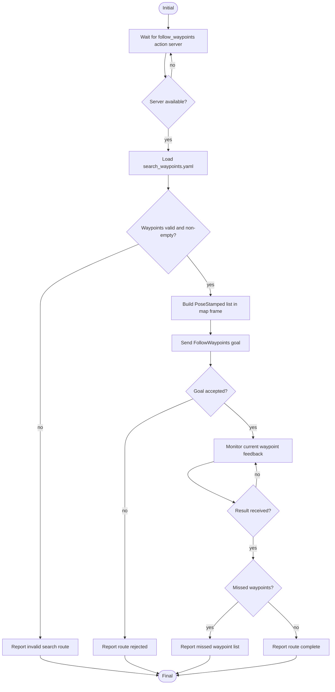

Cameo construction:

| Element | Detail |
| --- | --- |
| Partitions | NavigationSubsystem, Nav2Stack, WaypointSearchNode |
| Input | `search_waypoints.yaml`, `follow_waypoints` action server availability |
| Output | accepted route, missed waypoint list, success/failure log |
| Guards | `[server available]`, `[waypoints non-empty]`, `[goal accepted]`, `[missed waypoints]` |
| Refines | `REQ-MVP-003`, `REQ-NAV-006`, `REQ-NAV-007`, `REQ-NAV-008` |

### 9.5 `ACT-05 NavigateAndRecover`

Purpose: navigation goal execution and recovery response.

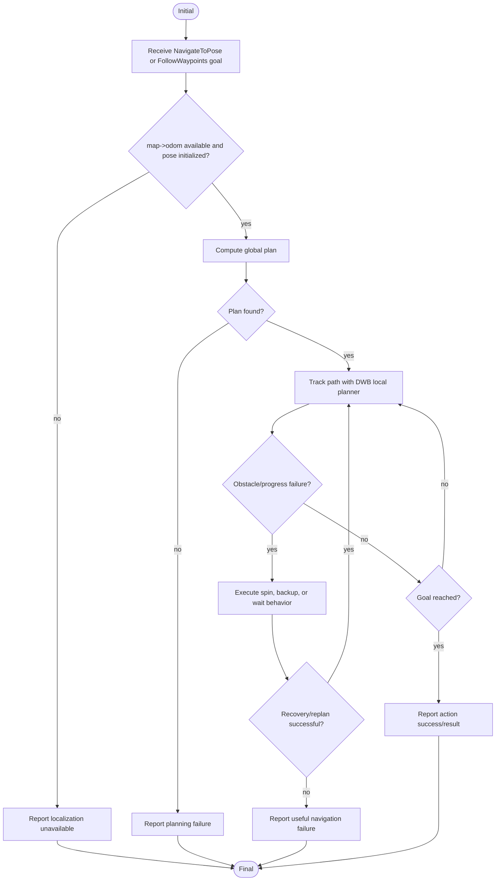

Cameo construction:

| Element | Detail |
| --- | --- |
| Partitions | Nav2 Planner, Nav2 Controller, Nav2 Behavior Server, SafetySubsystem |
| Inputs | `/scan`, `/odom`, map, initial pose, goal |
| Outputs | `/cmd_vel`, action result, recovery/failure logs |
| Guards | `[localized]`, `[plan found]`, `[obstacle/progress failure]`, `[recovery successful]` |
| Refines | `REQ-NAV-005`, `REQ-NAV-009`, `REQ-NAV-010`, `REQ-SAFE-009` |

### 9.6 `ACT-06 DetectVisualBillieCandidate`

Purpose: camera input to detection publication.

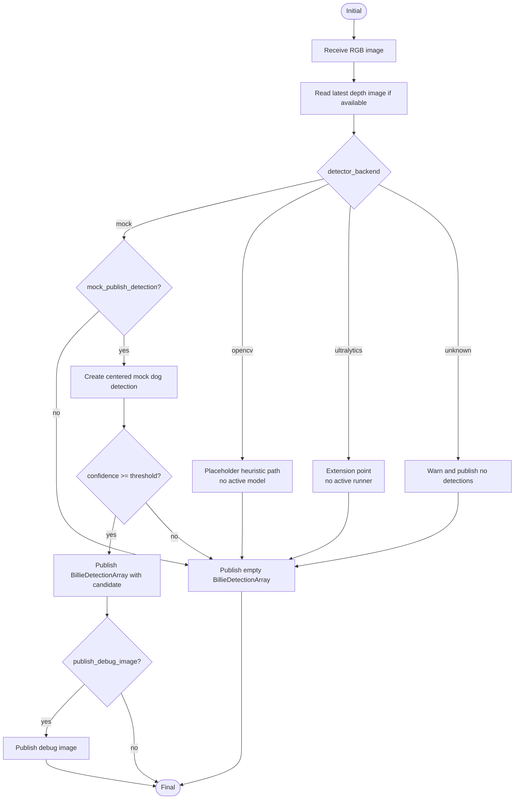

Cameo construction:

| Element | Detail |
| --- | --- |
| Partitions | Camera, VisualPerceptionSubsystem, DetectorBackend |
| Inputs | `RgbImageFlow`, `DepthImageFlow`, detector parameters |
| Outputs | `BillieDetectionFlow`, optional `DebugImageFlow` |
| Guards | `[mock_publish_detection]`, `[confidence >= threshold]`, `[publish_debug_image]` |
| Refines | `REQ-VIS-001` through `REQ-VIS-009` |

### 9.7 `ACT-07 DetectAudioEvent`

Purpose: audio or injected loudness to audio event.

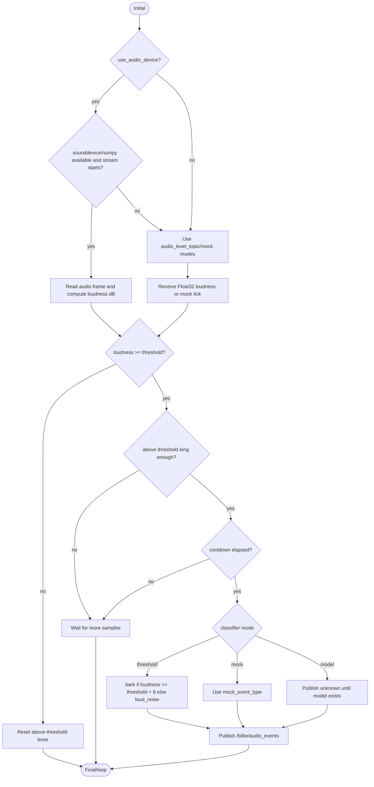

Cameo construction:

| Element | Detail |
| --- | --- |
| Partitions | AudioHardware, AudioPerceptionSubsystem, TestHarness |
| Inputs | `UsbAudioFlow`, `AudioLevelFlow`, parameters |
| Outputs | `AudioEventFlow` |
| Guards | `[use_audio_device]`, `[loudness >= threshold]`, `[duration >= minimum_event_duration]`, `[cooldown elapsed]` |
| Refines | `REQ-AUD-001` through `REQ-AUD-008` |

### 9.8 `ACT-08 ClassifyBillieState`

Purpose: rule-based fusion to state observation.

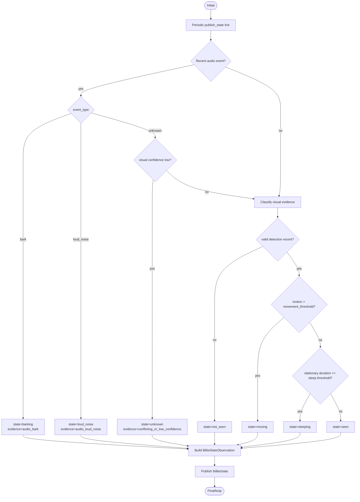

Cameo construction:

| Element | Detail |
| --- | --- |
| Partitions | StateEstimationSubsystem |
| Inputs | `BillieDetectionFlow`, `AudioEventFlow`, `WheelOdometryFlow` |
| Outputs | `StateObservationFlow` |
| Guards | `[audio age <= audio_event_timeout]`, `[detection age <= detection_timeout]`, `[motion > movement_threshold]`, `[stationary >= sleep_stationary_duration]` |
| Refines | `REQ-STATE-001` through `REQ-STATE-009` |

### 9.9 `ACT-09 LogObservationEvidence`

Purpose: persist state, detection, audio, and health evidence.

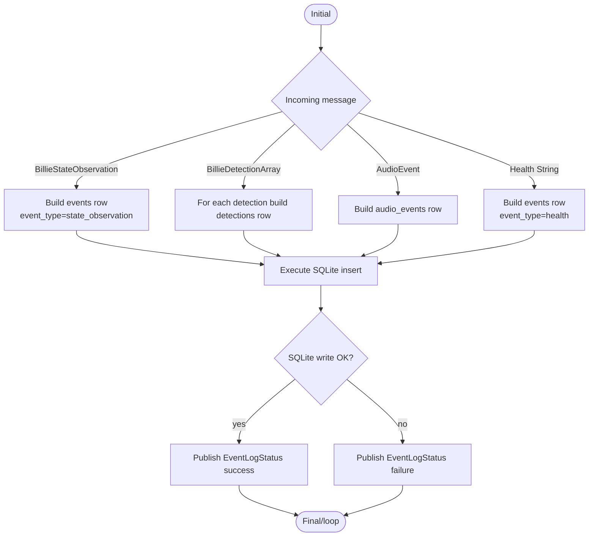

Cameo construction:

| Element | Detail |
| --- | --- |
| Partitions | EventLoggingSubsystem, SQLiteEventDatabase |
| Inputs | `StateObservationFlow`, `BillieDetectionFlow`, `AudioEventFlow`, `HealthEventFlow` |
| Outputs | SQLite rows, `EventLogStatusFlow` |
| Guards | `[log_state_observations]`, `[log_detections]`, `[log_audio_events]`, `[SQLite write OK]` |
| Refines | `REQ-LOG-001` through `REQ-LOG-007` |

### 9.10 `ACT-10 GenerateDailySummary`

Purpose: deterministic local summary generation.

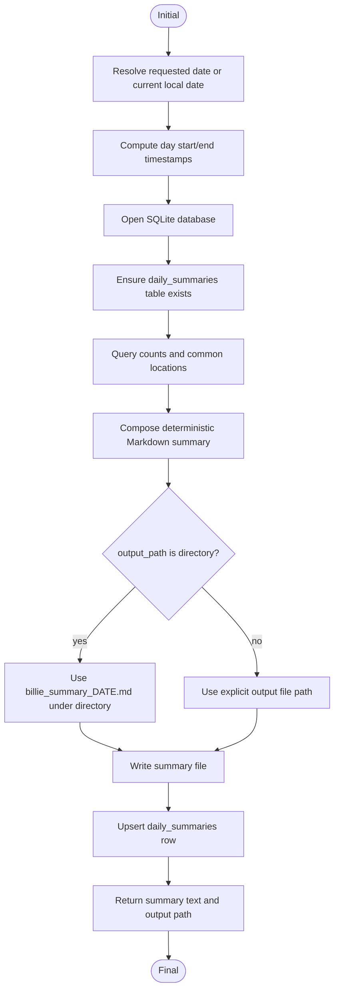

Cameo construction:

| Element | Detail |
| --- | --- |
| Partitions | DailySummarySubsystem, SQLiteEventDatabase, FileSystem |
| Inputs | `database_path`, optional `date`, optional `output_path` |
| Outputs | Markdown file, `daily_summaries` row |
| Guards | `[date provided]`, `[output path directory or no extension]`, `[database accessible]` |
| Refines | `REQ-SUM-001` through `REQ-SUM-004` |

### 9.11 `ACT-11 EnterSafeIdleOrEStop`

Purpose: terminal safe state after timeout, stop mode, E-stop, failed initialization, or failed mission.

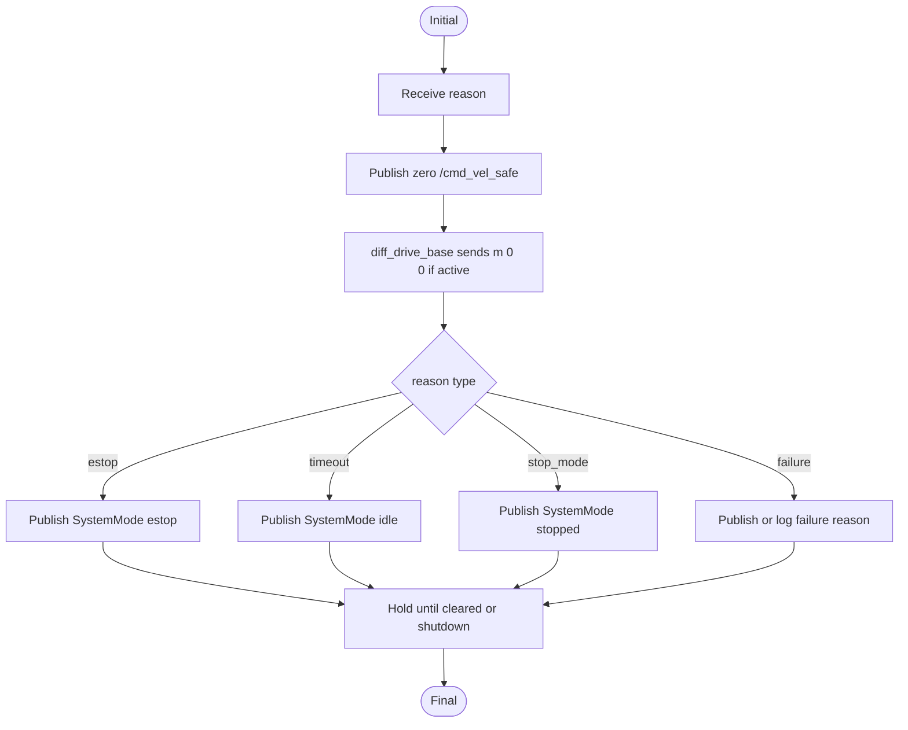

Cameo construction:

| Element | Detail |
| --- | --- |
| Partitions | SafetySubsystem, MobilitySubsystem, EventLoggingSubsystem |
| Inputs | E-stop, timeout, stop mode, initialization failure, navigation failure |
| Outputs | zero safe command, optional `m 0 0`, `SystemMode`, logs |
| Refines | `REQ-SAFE-002`, `REQ-SAFE-004`, `REQ-SAFE-005`, `REQ-SAFE-010` |

## 10. Activity-to-Block Allocation Matrix

| Activity | Logical block | Software / physical allocation |
| --- | --- | --- |
| `ACT-01 ExecuteMvpAutonomousMission` | all active MVP subsystems | `mvp_full.launch.py` composition |
| `ACT-02 InitializeAndVerifyRobot` | Compute, Communication, all active nodes | bringup launch files |
| `ACT-03 EnforceSafeMotion` | SafetySubsystem | `safety_supervisor_node` on Jetson |
| `ACT-04 ExecuteDeterministicSearchRoute` | NavigationSubsystem | `waypoint_search_node`, Nav2 waypoint follower |
| `ACT-05 NavigateAndRecover` | NavigationSubsystem, SafetySubsystem | Nav2 stack, RPLidar, drive base |
| `ACT-06 DetectVisualBillieCandidate` | VisualPerceptionSubsystem | `mock_camera_node` or `oak`, `billie_detector_node` |
| `ACT-07 DetectAudioEvent` | AudioPerceptionSubsystem | `audio_event_node`, ReSpeaker or injected topic |
| `ACT-08 ClassifyBillieState` | StateEstimationSubsystem | `billie_state_estimator` |
| `ACT-09 LogObservationEvidence` | EventLoggingSubsystem | `event_logger_node`, SQLite database |
| `ACT-10 GenerateDailySummary` | DailySummarySubsystem | `daily_summary_node`, `generate_summary` |
| `ACT-11 EnterSafeIdleOrEStop` | SafetySubsystem, MobilitySubsystem | `safety_supervisor_node`, `diff_drive_base`, Arduino firmware |

## 11. Verification Matrix

Create each row as a `TestCase` element in `06_Verification`. Link with `verify`.

| Test ID | Existing test / procedure | Primary verifies | Evidence |
| --- | --- | --- | --- |
| `TC-001 Motor Spin` | `ros2 run billiebot_tests test_motor_spin` | `REQ-MOB-001`, `REQ-MOB-003`, `REQ-MOB-004` | command output, `/odom`, video if hardware |
| `TC-002 Encoder Counts` | `ros2 run billiebot_tests test_encoder_counts` | `REQ-MOB-005`, `REQ-MOB-007` | `/odom` delta |
| `TC-003 Teleop Drive` | `ros2 run billiebot_tests test_teleop_drive` | `REQ-MOB-001`, `REQ-MOB-007` | `/odom` delta |
| `TC-004 Lidar Scan` | `ros2 run billiebot_tests test_lidar_scan` | `REQ-NAV-001` | `/scan` count/rate |
| `TC-005 Camera OAK-D` | `ros2 run billiebot_tests test_camera_oakd` | `REQ-VIS-001`, `REQ-VIS-002` | image dimensions |
| `TC-006 Audio Event` | `ros2 run billiebot_tests test_audio_event --ros-args -p mock_inject:=true` | `REQ-AUD-001`, `REQ-AUD-002` | `AudioEvent` message |
| `TC-007 Bark Detection` | `ros2 run billiebot_tests test_bark_detection --ros-args -p mock_inject:=true` | `REQ-AUD-003`, `REQ-MVP-005` | event type received |
| `TC-008 Forward 1 m` | `ros2 run billiebot_tests test_forward_1m` | `REQ-MOB-010` | odom distance, manual measurement |
| `TC-009 Rotate 360` | `ros2 run billiebot_tests test_rotate_360` | `REQ-MOB-010` | yaw accumulation, manual heading |
| `TC-010 SLAM Map` | `ros2 run billiebot_tests test_slam_map` | `REQ-NAV-003`, `REQ-MVP-002` | non-empty `/map` |
| `TC-011 AMCL Localization` | `ros2 run billiebot_tests test_localization_amcl` | `REQ-NAV-004` | `/amcl_pose`, `map->odom` TF |
| `TC-012 Nav2 Waypoint` | `ros2 run billiebot_tests test_nav2_waypoint` | `REQ-NAV-005`, `REQ-MVP-001` | action acceptance/result |
| `TC-013 Search Route` | `ros2 run billiebot_tests test_search_route --ros-args -p waypoints_file:=...` | `REQ-NAV-006`, `REQ-NAV-007`, `REQ-NAV-008` | route result |
| `TC-014 Billie Visual Detection` | `ros2 run billiebot_tests test_billie_visual_detection --ros-args -p require_detection:=true` | `REQ-VIS-004`, `REQ-VIS-007` | detection array |
| `TC-015 State Logging` | `ros2 run billiebot_tests test_state_logging --ros-args -p database_path:=...` | `REQ-LOG-001`, `REQ-LOG-003`, `REQ-LOG-007` | DB row and status |
| `TC-016 Daily Summary` | `ros2 run billiebot_tests test_daily_summary` | `REQ-SUM-001`, `REQ-SUM-002`, `REQ-SUM-003`, `REQ-SUM-004` | summary file and DB row |
| `TC-017 Safety Stop` | `ros2 run billiebot_tests test_safety_stop` | `REQ-SAFE-001`, `REQ-SAFE-004`, `REQ-SAFE-008` | clamped command, zero after E-stop |
| `TC-018 Power Rail Manual` | `test_power_rail_manual.md` | power support, safe operation | voltage log, no resets |
| `TC-019 Stuck Recovery Manual` | `test_stuck_recovery_manual.md` | `REQ-NAV-009`, `REQ-SAFE-009` | operator notes, logs, video |
| `TC-020 Mock Smoke Sequence` | `ros2 run billiebot_tests run_mvp_smoke_tests.sh` | `REQ-IF-002`, `REQ-IF-006`, integration | script output |
| `TC-021 MVP Scope Inspection` | manual model/launch/code inspection | `REQ-MVP-009`, `REQ-FUT-006` | no active Behavior AI nodes |
| `TC-022 Future Interface Inspection` | model inspection | `REQ-MVP-010`, `REQ-FUT-*` | IBD-06 and package review |

## 12. Requirement Traceability Matrix

Abbreviated matrix for model creation. The Cameo model should create a full matrix from these relationships.

| Requirement group | Satisfying blocks | Refining activities | Demonstrating IBDs | Verifying tests |
| --- | --- | --- | --- | --- |
| `REQ-MVP-*` | all active logical blocks | `ACT-01` plus capability activities | `IBD-01` | `TC-001` through `TC-022` |
| `REQ-NAV-*` | `NavigationSubsystem`, `RPLidarA1`, `Nav2Stack` | `ACT-04`, `ACT-05` | `IBD-01`, `IBD-05` | `TC-004`, `TC-010` through `TC-013`, `TC-019` |
| `REQ-MOB-*` | `MobilitySubsystem`, `ArduinoNano`, `DifferentialDriveBase` | `ACT-03`, `ACT-11` | `IBD-02`, `IBD-05` | `TC-001`, `TC-002`, `TC-003`, `TC-008`, `TC-009` |
| `REQ-VIS-*` | `VisualPerceptionSubsystem`, `OAKDLite` | `ACT-06` | `IBD-03`, `IBD-05` | `TC-005`, `TC-014` |
| `REQ-AUD-*` | `AudioPerceptionSubsystem`, `ReSpeakerXVF3800` | `ACT-07` | `IBD-03`, `IBD-05` | `TC-006`, `TC-007` |
| `REQ-STATE-*` | `StateEstimationSubsystem` | `ACT-08` | `IBD-03` | targeted state tests, `TC-015` evidence |
| `REQ-LOG-*` | `EventLoggingSubsystem`, `SQLiteEventDatabase` | `ACT-09` | `IBD-04` | `TC-015` |
| `REQ-SUM-*` | `DailySummarySubsystem`, `SQLiteEventDatabase` | `ACT-10` | `IBD-04` | `TC-016` |
| `REQ-SAFE-*` | `SafetySubsystem`, `MobilitySubsystem` | `ACT-03`, `ACT-11` | `IBD-02` | `TC-017`, timeout tests, `TC-019` |
| `REQ-IF-*` | `ComputeSubsystem`, launch files, nodes | `ACT-02` | all IBDs | `TC-020`, launch inspection |
| `REQ-FUT-*` | `FutureBehaviorAISubsystem`, `SafetySubsystem` | none active; model notes only | `IBD-06` | `TC-021`, `TC-022` |

## 13. Cameo Build Procedure

1. Create the package hierarchy from Section 3.
2. Create all requirements in Section 5 as SysML `Requirement` elements.
3. Create context blocks from Section 4 and build `BDD-01 System Context`.
4. Create logical blocks from Section 6.1 and build `BDD-02 Logical Architecture`.
5. Create physical/software blocks from Section 6.2 and build `BDD-03 Physical/Software Deployment`.
6. Create interface blocks and item flows from Section 7.
7. Build `IBD-01` through `IBD-06` using Sections 8.1 through 8.6.
8. Build `ACT-01` through `ACT-11` using Section 9.
9. Create allocation relationships from Section 10.
10. Create test cases from Section 11.
11. Build matrices:
    - `MAT-01 Requirement Satisfaction Matrix`
    - `MAT-02 Requirement Refinement Matrix`
    - `MAT-03 Interface Completeness Matrix`
    - `MAT-04 Activity Allocation Matrix`
    - `MAT-05 Verification Matrix`
    - `MAT-06 MVP Scope Boundary Matrix`
12. Run the model quality checks in Section 14.

## 14. Model Quality Gates

| Gate | Pass criterion |
| --- | --- |
| Requirements coverage | Every active requirement has at least one satisfy, refine, and verify path. |
| Activity completeness | Every Activity Diagram has initial/final nodes, partitions, named actions, guards, object flows, and failure paths where relevant. |
| IBD completeness | Every active ROS topic, service, action, serial command, hardware bus, and storage interface is shown in at least one IBD. |
| Allocation completeness | Every activity is allocated to logical block, software node, and physical host where applicable. |
| Safety boundary | All motion commands, including future policy commands, pass through `SafetySubsystem` before `MobilitySubsystem`. |
| MVP boundary | No active activity calls `PolicyEngine`, `RewardModel`, `TreatDispenser`, autonomous speech, or engagement action selection. |
| Verification realism | Existing tests are used where available; missing targeted tests are identified explicitly rather than implied as already implemented. |
| Maintainability | Diagrams reuse model elements; avoid duplicate text-only blocks. |

## 15. Recommended Additional Verification Cases

The current repository has strong bring-up tests. These additional tests would improve requirement coverage if implemented later.

| Proposed test | Covers | Why |
| --- | --- | --- |
| `test_safety_timeout` | `REQ-SAFE-002`, `REQ-SAFE-007`, `REQ-SAFE-010` | Explicitly verifies zero output and mode after command timeout. |
| `test_estop_topic` | `REQ-SAFE-003` | Existing test covers service; topic path should also be verified. |
| `test_state_visual_rules` | `REQ-STATE-003` through `REQ-STATE-006` | Verifies not_seen/seen/moving/sleeping rules deterministically. |
| `test_state_audio_precedence` | `REQ-STATE-007`, `REQ-STATE-008` | Verifies recent audio overrides or conflicts with visual evidence. |
| `test_logger_detection_audio_rows` | `REQ-LOG-004`, `REQ-LOG-005` | Current state logging test covers state rows; detection/audio DB rows should be explicit. |
| `test_system_mode_topic` | `REQ-SAFE-005` through `REQ-SAFE-008` | Verifies `active`, `idle`, `stopped`, and `estop` mode strings and reasons. |
| `test_future_boundary_static` | `REQ-MVP-009`, `REQ-FUT-006` | Static check that MVP launch files do not include future engagement nodes. |

## 16. Final Deliverable Checklist

The Cameo/MSOSA model built from this report is complete when it contains:

- Requirements from Section 5.
- Context, logical, and physical BDDs.
- IBD-01 through IBD-06.
- ACT-01 through ACT-11.
- Interface blocks and item flows from Section 7.
- Allocation relationships from Section 10.
- Test cases and verify relationships from Section 11.
- Matrices listed in Section 13.
- Inactive future Behavior AI package with no active MVP allocations.
- Model quality gates passed.

End of report.
